# Build Site: self.curator Test Suite

Generated: 2026-04-11

Task IDs: T-100 through T-137 (38 tasks)
Source kits: cavekit-curator-test-infra.md, cavekit-curator-api-contract.md, cavekit-curator-pipeline-integration.md

---

## Tier 0 -- No Dependencies

| Task | Title | Cavekit | Requirement | blockedBy | Effort |
|------|-------|---------|-------------|-----------|--------|
| T-100 | Create unified test directory structure with sub-packages | cavekit-curator-test-infra.md | R1 | -- | S |
| T-101 | Build shared fixtures: TestClient, temp workspace, job state factory | cavekit-curator-test-infra.md | R2 | -- | M |
| T-102 | Build shared fixtures: JSONL and Parquet fixture data files | cavekit-curator-test-infra.md | R2 | -- | S |
| T-103 | Preserve upstream shared_ray_cluster fixture | cavekit-curator-test-infra.md | R2 | -- | S |

## Tier 1 -- Depends on Tier 0

| Task | Title | Cavekit | Requirement | blockedBy | Effort |
|------|-------|---------|-------------|-----------|--------|
| T-104 | Register pytest markers (fast, integration, gpu) and verify selective execution | cavekit-curator-test-infra.md | R3 | T-100 | M |
| T-105 | Implement VRAM guard auto-skip for gpu-marked tests | cavekit-curator-test-infra.md | R4 | T-104 | M |
| T-106 | Migrate 125 node tests to tests/nodes/, fix bugs, verify registry coverage | cavekit-curator-test-infra.md | R5 | T-100, T-104 | L |
| T-107 | Create CI entrypoint shell script with marker selection and JUnit output | cavekit-curator-test-infra.md | R6 | T-100, T-104 | M |

## Tier 2 -- API Contract Tests (Depends on Tier 0 + Tier 1)

All API contract tests are `fast`-marked. They depend on TestClient + temp workspace + job state factory (T-101) and markers (T-104).

| Task | Title | Cavekit | Requirement | blockedBy | Effort |
|------|-------|---------|-------------|-----------|--------|
| T-108 | Test health endpoint schema and dynamic job counts | cavekit-curator-api-contract.md | R1 | T-101, T-104 | M |
| T-109 | Test stage discovery: category listing, counts, per-category filtering | cavekit-curator-api-contract.md | R2 | T-101, T-104 | M |
| T-110 | Test stage discovery: detail schema and error cases (404s) | cavekit-curator-api-contract.md | R2 | T-101, T-104 | S |
| T-111 | Test custom stage CRUD lifecycle: create, list, get, delete | cavekit-curator-api-contract.md | R3 | T-101, T-104 | M |
| T-112 | Test custom stage validation: invalid code, no subclass, duplicate names, validate-name | cavekit-curator-api-contract.md | R3 | T-101, T-104 | M |
| T-113 | Test job creation: valid/invalid inputs, status by schedule, stages_count | cavekit-curator-api-contract.md | R4 | T-101, T-102, T-104 | M |
| T-114 | Test job listing order and get/404 | cavekit-curator-api-contract.md | R4 | T-101, T-102, T-104 | S |
| T-115 | Test job state machine: valid transitions (pending/scheduled/running/cancelled) | cavekit-curator-api-contract.md | R5 | T-101, T-104 | M |
| T-116 | Test job state machine: invalid transitions (all rejection cases) | cavekit-curator-api-contract.md | R5 | T-101, T-104 | M |
| T-117 | BUG: Test output_format config persistence (parquet, jsonl, null) | cavekit-curator-api-contract.md | R6 | T-101, T-104 | M |
| T-118 | BUG: Test approve failure state consistency (failed status, error_message, finished_at) | cavekit-curator-api-contract.md | R7 | T-101, T-104 | M |
| T-119 | BEHAVIOR: Test scheduled jobs explicit non-auto-start via _poll_jobs() | cavekit-curator-api-contract.md | R8 | T-101, T-104 | S |
| T-120 | Test job logs: lines array, tail param, empty log, streaming, 404 cases | cavekit-curator-api-contract.md | R9 | T-101, T-104 | M |
| T-121 | Test error response contract: detail key, 422, content-type, /api/data schema | cavekit-curator-api-contract.md | R10 | T-101, T-104 | M |
| T-122 | Test concurrent state safety: parallel creates, concurrent read/write, jobs.json integrity | cavekit-curator-api-contract.md | R11 | T-101, T-104 | M |

## Tier 2 -- Pipeline Integration Tests (Depends on Tier 0 + Tier 1)

Pipeline tests depend on fixture data (T-102), markers (T-104), and VRAM guard (T-105) where applicable.

| Task | Title | Cavekit | Requirement | blockedBy | Effort |
|------|-------|---------|-------------|-----------|--------|
| T-123 | Test config round-trip: build_pipeline() parsing, writer selection, type preservation | cavekit-curator-pipeline-integration.md | R1 | T-101, T-102, T-104 | M |
| T-124 | Test stage registry completeness: load, counts, instantiation, FastText graceful failure | cavekit-curator-pipeline-integration.md | R2 | T-104 | M |
| T-125 | Test stage registry: get_text_stage_detail() for all keys and fallback path | cavekit-curator-pipeline-integration.md | R2 | T-104 | S |
| T-126 | Test streaming pipeline: JSONL through filter + modifier + writer, exit code 0 | cavekit-curator-pipeline-integration.md | R3 | T-101, T-102, T-104 | M |
| T-127 | BUG: Test text_field propagation -- multi-modifier config, no mutation of original dict | cavekit-curator-pipeline-integration.md | R4 | T-101, T-102, T-104 | M |
| T-128 | Test ExactDedup: known duplicates removed, unique preserved, two-phase workflow | cavekit-curator-pipeline-integration.md | R5 | T-101, T-102, T-104, T-105 | M |
| T-129 | Test FuzzyDedup: near-duplicates removed, cudf/VRAM skip, CPU path, output path | cavekit-curator-pipeline-integration.md | R6 | T-101, T-102, T-104, T-105 | M |
| T-130 | Test mixed pipeline: filter + modifier + ExactDedup, intermediate dir cleanup | cavekit-curator-pipeline-integration.md | R7 | T-101, T-102, T-104 | M |
| T-131 | Test IO format matrix: JSONL/Parquet cross-format, text preservation, record count | cavekit-curator-pipeline-integration.md | R8 | T-101, T-102, T-104 | M |
| T-132 | Test error paths: unknown stage, missing input, malformed JSONL, unsupported formats | cavekit-curator-pipeline-integration.md | R9 | T-101, T-102, T-104 | M |
| T-133 | Test error paths: zero-match filter empty output and nonzero exit code | cavekit-curator-pipeline-integration.md | R9 | T-101, T-102, T-104 | S |
| T-134 | Test resource safety: fixture sizes, marker correctness, temp cleanup | cavekit-curator-pipeline-integration.md | R10 | T-104, T-105 | M |
| T-135 | Test resource safety: no orphan Ray/subprocess processes, subprocess timeout | cavekit-curator-pipeline-integration.md | R10 | T-104, T-105 | M |

## Tier 3 -- Cross-Cutting Validation (Depends on Tier 2)

| Task | Title | Cavekit | Requirement | blockedBy | Effort |
|------|-------|---------|-------------|-----------|--------|
| T-136 | Verify all migrated node tests pass under unified test runner | cavekit-curator-test-infra.md | R5, R6 | T-106, T-107 | S |
| T-137 | Full suite dry-run: pytest --collect-only validates discovery, markers, no orphan test files | cavekit-curator-test-infra.md | R1, R3, R6 | T-106, T-107, T-108 | S |

---

## Tier 4 -- Revisions from /ck:check (2026-04-12)

| Task | Title | Cavekit | Requirement | blockedBy | Effort |
|------|-------|---------|-------------|-----------|--------|
| T-138 | Fix run_tests.sh unquoted MARKER_ARG (array form) for multi-word TEST_MARKERS | cavekit-curator-test-infra.md | R6 | T-107 | S |
| T-139 | Refactor _poll_jobs into _poll_jobs_once helper + add direct invocation test for R13 | cavekit-curator-api-contract.md | R13 | T-119 | M |
| T-140 | Document custom-stage security deferral in kit prose + test-file comment (R12) | cavekit-curator-api-contract.md | R12 | T-111 | S |
| T-141 | Expand R10 detail-key tests to cover 400/422 cases | cavekit-curator-api-contract.md | R10 | T-121 | S |
| T-142 | Add parquet→jsonl IO matrix case (R8 AC4) + record-count invariant assertion (R8 AC6) | cavekit-curator-pipeline-integration.md | R8 | T-131 | S |
| T-143 | Add R9 missing tests: malformed JSONL, unsupported input extension (.csv), zero-match filter empty output | cavekit-curator-pipeline-integration.md | R9 | T-132 | M |
| T-144 | Fix _detect_filetype nonexistent-path silent fallthrough (raise or sentinel) | cavekit-curator-pipeline-integration.md | R9 | T-132 | S |
| T-145 | Add _detect_filetype file-path regression tests (R12 new reqt) | cavekit-curator-pipeline-integration.md | R12 | T-125 | S |
| T-146 | Add _dedup_cache directory cleanup in run_pipeline.py + R11 test | cavekit-curator-pipeline-integration.md | R11 | T-130 | S |
| T-147 | Add orphan .tmp file cleanup at _load_jobs() startup (finding F-003) | cavekit-curator-api-contract.md | R11 | T-122 | S |
| T-148 | Replace hardcoded /app/api in sub-package conftests with portable Path (finding F-014) | cavekit-curator-test-infra.md | R2 | T-101 | S |
| T-149 | Rename test_concurrent_creates_unique_ids + add companion test that exercises _save_jobs from N threads directly (finding F-007) | cavekit-curator-api-contract.md | R11 | T-122 | S |
| T-150 | Add unique class-name check in validate_custom_stage_name (finding F-013) | cavekit-curator-api-contract.md | R3 | T-112 | S |
| T-151 | Dedup workflow debug pass — investigate TextDuplicatesRemovalWorkflow phase-B field mismatch to un-skip R5/R6/R7 | cavekit-curator-pipeline-integration.md | R5, R6, R7 | T-128, T-129, T-130 | L |

---

## Summary

| Metric | Count |
|--------|-------|
| Total tasks | 38 |
| Tier 0 | 4 |
| Tier 1 | 4 |
| Tier 2 (API Contract) | 15 |
| Tier 2 (Pipeline Integration) | 13 |
| Tier 3 | 2 |
| Small (S) | 9 |
| Medium (M) | 27 |
| Large (L) | 2 |
| cavekit-curator-test-infra.md tasks | 10 |
| cavekit-curator-api-contract.md tasks | 15 |
| cavekit-curator-pipeline-integration.md tasks | 13 |
| Total acceptance criteria | 190 |
| AC coverage | 190/190 (100%) |

---

## Coverage Matrix

Every acceptance criterion from all 27 requirements mapped to its task(s). 190 AC total, 190 covered.

### cavekit-curator-test-infra.md (39 AC)

#### R1: Unified Test Layout (6 AC)

| # | Acceptance Criterion | Task(s) |
|---|---------------------|---------|
| 1 | tests/nodes/ sub-package exists with node tests | T-100 |
| 2 | tests/api/ sub-package exists with API contract tests | T-100 |
| 3 | tests/pipeline/ sub-package exists with pipeline integration tests | T-100 |
| 4 | Each sub-package has __init__.py | T-100 |
| 5 | pytest tests/ discovers tests in all three sub-packages | T-100, T-137 |
| 6 | No test file exists outside these three sub-packages (excluding conftest.py) | T-100, T-137 |

#### R2: Shared Fixtures (8 AC)

| # | Acceptance Criterion | Task(s) |
|---|---------------------|---------|
| 1 | Root tests/conftest.py provides fixtures to all sub-packages | T-101 |
| 2 | TestClient fixture wraps FastAPI app without real server | T-101 |
| 3 | Temp workspace fixture creates isolated dir tree (configs/, data/, logs/, jobs/, custom_stages/) and removes after test | T-101 |
| 4 | Job state factory creates CurationJob instances with configurable status/timestamps/paths in _jobs dict | T-101 |
| 5 | JSONL fixture data < 50 records, < 1 MB | T-102 |
| 6 | Parquet fixture data with same records as JSONL, < 1 MB | T-102 |
| 7 | Fixture data contains text field with realistic multi-word string content | T-102 |
| 8 | Upstream shared_ray_cluster session fixture preserved and available | T-103 |

#### R3: Pytest Markers (8 AC)

| # | Acceptance Criterion | Task(s) |
|---|---------------------|---------|
| 1 | Marker fast registered in pytest config | T-104 |
| 2 | Marker integration registered in pytest config | T-104 |
| 3 | Marker gpu registered in pytest config | T-104 |
| 4 | pytest -m fast runs only fast-marked tests, zero integration/gpu collected | T-104 |
| 5 | pytest -m integration runs only integration-marked tests | T-104 |
| 6 | pytest -m gpu runs only gpu-marked tests | T-104 |
| 7 | pytest -m "not gpu" excludes all gpu-marked tests | T-104 |
| 8 | All migrated node tests marked fast | T-106 |

#### R4: VRAM Guard (5 AC)

| # | Acceptance Criterion | Task(s) |
|---|---------------------|---------|
| 1 | Mechanism queries free GPU memory before each gpu-marked test | T-105 |
| 2 | Below-threshold VRAM skips test with descriptive message (required vs available) | T-105 |
| 3 | Threshold overridable via env var or pytest option | T-105 |
| 4 | VRAM check does not fail/raise if no GPU present (returns 0) | T-105 |
| 5 | fast/integration-only tests never subject to VRAM checks | T-105 |

#### R5: Node Test Migration (6 AC)

| # | Acceptance Criterion | Task(s) |
|---|---------------------|---------|
| 1 | All 125 existing tests present in tests/nodes/ (same names/assertions unless fixed) | T-106 |
| 2 | Original tests/api/test_pipeline_nodes.py removed | T-106 |
| 3 | Modified tests have code comment explaining fix | T-106 |
| 4 | All migrated tests pass with pytest tests/nodes/ -m fast | T-106, T-136 |
| 5 | Registry coverage verified: every key in all three registries has a test | T-106 |
| 6 | Missing registry key coverage filled with instantiation test | T-106 |

#### R6: CI Entrypoint (6 AC)

| # | Acceptance Criterion | Task(s) |
|---|---------------------|---------|
| 1 | Entrypoint script exists at documented path | T-107 |
| 2 | No-arg execution runs pytest tests/ (all tests) | T-107 |
| 3 | TEST_MARKERS env var passes value as -m to pytest | T-107 |
| 4 | Nonzero exit code on any test failure | T-107 |
| 5 | JUnit XML output to predictable path | T-107 |
| 6 | Invocable via docker compose exec / docker exec | T-107, T-137 |

### cavekit-curator-api-contract.md (89 AC)

#### R1: Health Endpoint (9 AC)

| # | Acceptance Criterion | Task(s) |
|---|---------------------|---------|
| 1 | GET /health returns HTTP 200 | T-108 |
| 2 | Response contains keys: status, running_jobs, jobs_total, api_version | T-108 |
| 3 | status is "ok" | T-108 |
| 4 | running_jobs is integer >= 0 | T-108 |
| 5 | jobs_total is integer >= 0 | T-108 |
| 6 | api_version is non-empty string matching semver | T-108 |
| 7 | No jobs created: running_jobs 0, jobs_total 0 | T-108 |
| 8 | After creating N jobs, jobs_total equals N | T-108 |
| 9 | running_jobs reflects only status "running", not pending/scheduled/completed | T-108 |

#### R2: Stage Discovery (14 AC)

| # | Acceptance Criterion | Task(s) |
|---|---------------------|---------|
| 1 | GET /api/text returns 200 with JSON object keyed by category names | T-109 |
| 2 | Response includes categories: filters, modifiers, classifiers | T-109 |
| 3 | Each category value is list of objects with id, name, source | T-109 |
| 4 | Filter count matches _FILTER_CLASS_REGISTRY size (35) | T-109 |
| 5 | Modifier count matches _MODIFIER_CLASS_REGISTRY size (9) | T-109 |
| 6 | Classifier count matches _CLASSIFIER_CLASS_REGISTRY size (8) | T-109 |
| 7 | GET /api/text/filters/stages returns only filter stages | T-109 |
| 8 | GET /api/text/modifiers/stages returns only modifier stages | T-109 |
| 9 | GET /api/text/classifiers/stages returns only classifier stages | T-109 |
| 10 | GET /api/text/nonexistent/stages returns 404 | T-110 |
| 11 | GET /api/text/filters/stages/WordCountFilter returns detail object with id, name, category, description, module, parameters, resources | T-110 |
| 12 | parameters is list of objects with name, type, required | T-110 |
| 13 | GET /api/text/filters/stages/NonexistentFilter returns 404 | T-110 |
| 14 | GET /api/text/modifiers/stages/WordCountFilter returns 404 (wrong category) | T-110 |

#### R3: Custom Stage CRUD (14 AC)

| # | Acceptance Criterion | Task(s) |
|---|---------------------|---------|
| 1 | POST /api/text/custom/stages with valid data returns 201 | T-111 |
| 2 | Response contains id (UUID), name, source ("custom"), category | T-111 |
| 3 | GET /api/text/custom/stages lists created stage with matching id/name | T-111 |
| 4 | GET /api/text/custom/stages/{uuid} returns full detail with code field | T-111 |
| 5 | DELETE /api/text/custom/stages/{uuid} returns 200 with status: "deleted" | T-111 |
| 6 | After deletion, GET detail returns 404 | T-111 |
| 7 | After deletion, GET list no longer includes deleted stage | T-111 |
| 8 | POST with invalid Python code (syntax error) returns 400 | T-112 |
| 9 | POST with code defining no ProcessingStage subclass returns 400 | T-112 |
| 10 | POST with name matching existing builtin returns 400 | T-112 |
| 11 | POST with name matching existing custom stage returns 400 | T-112 |
| 12 | DELETE nonexistent UUID returns 404 | T-112 |
| 13 | POST validate-name with available name returns {available: true} | T-112 |
| 14 | POST validate-name with builtin name returns {available: false, reason: ...} | T-112 |

#### R4: Job Creation and Validation (11 AC)

| # | Acceptance Criterion | Task(s) |
|---|---------------------|---------|
| 1 | POST /api/jobs with valid inputs returns 201 | T-113 |
| 2 | Response contains job_id, name, status, input_path, output_path, stages_count, created_at, log_file, config_file | T-113 |
| 3 | Status "pending" for immediate jobs (no scheduled_for) | T-113 |
| 4 | Status "scheduled" for future scheduled_for | T-113 |
| 5 | Status "pending" for past scheduled_for (treated as immediate) | T-113 |
| 6 | stages_count equals number of stages in request | T-113 |
| 7 | Nonexistent input_path returns 400 with detail mentioning path | T-113 |
| 8 | Unknown stage type returns 400 with detail mentioning stage type | T-113 |
| 9 | GET /api/jobs returns list sorted by created_at descending | T-114 |
| 10 | GET /api/jobs/{job_id} returns full detail for existing job | T-114 |
| 11 | GET /api/jobs/nonexistent returns 404 | T-114 |

#### R5: Job State Machine (14 AC)

| # | Acceptance Criterion | Task(s) |
|---|---------------------|---------|
| 1 | Pending -> approve -> "running" (mocked subprocess) | T-115 |
| 2 | Pending -> schedule (future) -> "scheduled" | T-115 |
| 3 | Scheduled -> unschedule -> "pending", scheduled_for cleared | T-115 |
| 4 | Scheduled -> approve -> "running", scheduled_for cleared | T-115 |
| 5 | Running -> DELETE -> "cancelled", finished_at set | T-115 |
| 6 | Running -> POST cancel -> "cancelled" (same as DELETE) | T-115 |
| 7 | Pending -> DELETE -> "cancelled" | T-115 |
| 8 | Scheduled -> DELETE -> "cancelled" | T-115 |
| 9 | Approve already-running -> 400 | T-116 |
| 10 | Approve completed -> 400 | T-116 |
| 11 | Cancel completed -> 400 | T-116 |
| 12 | Cancel failed -> 400 | T-116 |
| 13 | Schedule running -> 400 | T-116 |
| 14 | Unschedule pending (non-scheduled) -> 400 | T-116 |

#### R6: BUG -- output_format Config Persistence (4 AC)

| # | Acceptance Criterion | Task(s) |
|---|---------------------|---------|
| 1 | output_format: "parquet" written to config JSON on disk | T-117 |
| 2 | output_format: "jsonl" written to config JSON on disk | T-117 |
| 3 | output_format null/omitted: key omitted or null in config JSON | T-117 |
| 4 | Config JSON contains ALL request fields (name, input_path, output_path, text_field, stages, output_format) | T-117 |

#### R7: BUG -- Approve Failure State Consistency (5 AC)

| # | Acceptance Criterion | Task(s) |
|---|---------------------|---------|
| 1 | Failed _start_job() due to missing config -> status "failed" (not "running") | T-118 |
| 2 | Failed _start_job() due to log file creation error -> status "failed" | T-118 |
| 3 | After failed approve, GET returns error_message describing failure | T-118 |
| 4 | After failed approve, finished_at is set | T-118 |
| 5 | Approve nonexistent job -> 404 | T-118 |

#### R8: BEHAVIOR -- Scheduled Jobs Non-Auto-Start (3 AC)

| # | Acceptance Criterion | Task(s) |
|---|---------------------|---------|
| 1 | Scheduled job with past scheduled_for does NOT auto-transition after _poll_jobs() | T-119 |
| 2 | Test includes comment: triggering is self.UI daemon responsibility | T-119 |
| 3 | After _poll_jobs(), status remains "scheduled", started_at unchanged | T-119 |

#### R9: Job Logs (7 AC)

| # | Acceptance Criterion | Task(s) |
|---|---------------------|---------|
| 1 | GET /api/jobs/{id}/logs returns 200 with lines array | T-120 |
| 2 | tail=5 returns only last 5 lines | T-120 |
| 3 | tail=100 (default) returns up to 100 lines | T-120 |
| 4 | Empty log file -> lines is empty array | T-120 |
| 5 | stream=true returns streaming response with text/plain | T-120 |
| 6 | Log file does not exist -> 404 | T-120 |
| 7 | Nonexistent job -> 404 | T-120 |

#### R10: Error Response Contract (5 AC)

| # | Acceptance Criterion | Task(s) |
|---|---------------------|---------|
| 1 | All 4xx/5xx responses contain detail key with human-readable string | T-121 |
| 2 | Invalid JSON body -> 422 | T-121 |
| 3 | All successful JSON responses have content-type application/json | T-121 |
| 4 | GET /api/data returns 200 with data_dir and files keys | T-121 |
| 5 | files array objects have path, name, size_bytes, relative_path | T-121 |

#### R11: Concurrent State Safety (3 AC)

| # | Acceptance Criterion | Task(s) |
|---|---------------------|---------|
| 1 | 10 concurrent creates -> 10 unique jobs in _jobs | T-122 |
| 2 | Concurrent GET during POST returns valid JSON (no partial writes) | T-122 |
| 3 | jobs.json never corrupted after concurrent operations | T-122 |

### cavekit-curator-pipeline-integration.md (62 AC)

#### R1: Config Round-Trip (5 AC)

| # | Acceptance Criterion | Task(s) |
|---|---------------------|---------|
| 1 | Config JSON with all fields correctly parsed by build_pipeline() | T-123 |
| 2 | output_format controls writer: JsonlWriter for "jsonl", ParquetWriter for "parquet" | T-123 |
| 3 | Omitted/null output_format defaults to "jsonl" writer | T-123 |
| 4 | Stage params passed with correct types (string/int/bool preserved) | T-123 |
| 5 | Config with 3+ stages -> correct number of processing stages (plus reader/writer) | T-123 |

#### R2: Stage Registry Completeness (9 AC)

| # | Acceptance Criterion | Task(s) |
|---|---------------------|---------|
| 1 | _load_text_stages() executes without errors | T-124 |
| 2 | get_text_stages_by_category() returns dict with filters, modifiers, classifiers | T-124 |
| 3 | Registry sizes match: 35 filters, 9 modifiers, 8 classifiers | T-124 |
| 4 | Every _FILTER_CLASS_REGISTRY class instantiates | T-124 |
| 5 | Every _MODIFIER_CLASS_REGISTRY class instantiates | T-124 |
| 6 | Every _CLASSIFIER_CLASS_REGISTRY class instantiates (instantiation-only for GPU) | T-124 |
| 7 | FastText graceful failure without model file | T-124 |
| 8 | get_text_stage_detail() returns non-None for every registry key | T-125 |
| 9 | Fallback path in build_pipeline() exercised and returns valid stage | T-125 |

#### R3: Streaming Pipeline (7 AC)

| # | Acceptance Criterion | Task(s) |
|---|---------------------|---------|
| 1 | JSONL input (10-50 records) processed through filter + modifier | T-126 |
| 2 | Output is valid JSONL with one JSON object per line | T-126 |
| 3 | Output records contain text field | T-126 |
| 4 | Filter stages reduce record count | T-126 |
| 5 | Modifier stages transform text content | T-126 |
| 6 | Multi-stage pipeline preserves record integrity (no duplication, no dropped fields) | T-126 |
| 7 | Pipeline completes with exit code 0 via run_pipeline.py | T-126 |

#### R4: BUG -- text_field Propagation (4 AC)

| # | Acceptance Criterion | Task(s) |
|---|---------------------|---------|
| 1 | build_pipeline() with multiple modifiers does not raise KeyError | T-127 |
| 2 | After build_pipeline(), original config dict stage params unmodified | T-127 |
| 3 | text_field passed to each modifier via Modify(input_fields=...) without consuming from params | T-127 |
| 4 | Two modifiers both specifying text_field: "content" both work correctly | T-127 |

#### R5: ExactDedup (6 AC)

| # | Acceptance Criterion | Task(s) |
|---|---------------------|---------|
| 1 | Known exact-duplicate records processed by run_exact_dedup() | T-128 |
| 2 | Output has fewer records than input | T-128 |
| 3 | All unique records from input present in output | T-128 |
| 4 | No unique records removed | T-128 |
| 5 | Two-phase workflow (ID identification, removal) completes without error | T-128 |
| 6 | Output written to specified output path | T-128 |

#### R6: FuzzyDedup (6 AC)

| # | Acceptance Criterion | Task(s) |
|---|---------------------|---------|
| 1 | Near-duplicate records processed by run_fuzzy_dedup() | T-129 |
| 2 | Output has fewer records than input | T-129 |
| 3 | Clearly distinct records preserved | T-129 |
| 4 | cudf unavailable or VRAM insufficient -> skip with message (not crash) | T-129 |
| 5 | Multi-phase workflow completes on CPU path | T-129 |
| 6 | Output written to specified output path | T-129 |

#### R7: Mixed Pipeline (5 AC)

| # | Acceptance Criterion | Task(s) |
|---|---------------------|---------|
| 1 | Config with filter + modifier + ExactDedup accepted by run_pipeline.py | T-130 |
| 2 | Intermediate directory ({output_path}_pre_dedup) created | T-130 |
| 3 | Final output contains deduplicated, filtered, modified data | T-130 |
| 4 | Intermediate directory cleaned up after success | T-130 |
| 5 | Output record count <= input count | T-130 |

#### R8: IO Format Matrix (6 AC)

| # | Acceptance Criterion | Task(s) |
|---|---------------------|---------|
| 1 | JSONL -> JSONL: output is valid JSONL | T-131 |
| 2 | Parquet -> Parquet: output is valid Parquet readable by pandas/pyarrow | T-131 |
| 3 | JSONL -> Parquet: output is valid Parquet with same content | T-131 |
| 4 | Parquet -> JSONL: output is valid JSONL with same content | T-131 |
| 5 | text field content preserved through format conversion | T-131 |
| 6 | Record count preserved (no-filter passthrough, no loss/duplication) | T-131 |

#### R9: Error Paths (7 AC)

| # | Acceptance Criterion | Task(s) |
|---|---------------------|---------|
| 1 | Unknown stage type -> ValueError with unknown type name | T-132 |
| 2 | Nonexistent input_path -> clear error (not generic traceback) | T-132 |
| 3 | Malformed JSONL input -> descriptive error, not unhandled exception | T-132 |
| 4 | Unsupported input file extension (.csv) -> ValueError "Unsupported input format" | T-132 |
| 5 | Unsupported output_format ("csv") -> ValueError "Unsupported output format" | T-132 |
| 6 | Zero-matching filter -> empty output file (not crash/missing output) | T-133 |
| 7 | run_pipeline.py exits with nonzero exit code on pipeline error | T-133 |

#### R10: Resource Safety (7 AC)

| # | Acceptance Criterion | Task(s) |
|---|---------------------|---------|
| 1 | All fixture data files < 1 MB each | T-134 |
| 2 | All GPU tests marked with gpu marker | T-134 |
| 3 | All Ray tests marked with integration marker | T-134 |
| 4 | Temp directories cleaned up after each test | T-134 |
| 5 | No orphan Ray worker processes after suite completes | T-135 |
| 6 | No orphan run_pipeline.py subprocesses after suite completes | T-135 |
| 7 | Tests invoking run_pipeline.py as subprocess set a timeout | T-135 |

---

## Dependency Graph

```mermaid
graph LR
    subgraph "Tier 0"
        T-100["T-100: Test directory structure"]
        T-101["T-101: TestClient + workspace + job factory"]
        T-102["T-102: JSONL + Parquet fixture data"]
        T-103["T-103: Preserve shared_ray_cluster"]
    end

    subgraph "Tier 1"
        T-104["T-104: Pytest markers"]
        T-105["T-105: VRAM guard"]
        T-106["T-106: Node test migration"]
        T-107["T-107: CI entrypoint script"]
    end

    subgraph "Tier 2: API Contract"
        T-108["T-108: Health endpoint"]
        T-109["T-109: Stage discovery counts"]
        T-110["T-110: Stage detail + 404s"]
        T-111["T-111: Custom CRUD lifecycle"]
        T-112["T-112: Custom validation + errors"]
        T-113["T-113: Job creation + validation"]
        T-114["T-114: Job listing + get/404"]
        T-115["T-115: State machine valid transitions"]
        T-116["T-116: State machine invalid transitions"]
        T-117["T-117: BUG output_format persistence"]
        T-118["T-118: BUG approve failure state"]
        T-119["T-119: BEHAVIOR scheduled non-auto-start"]
        T-120["T-120: Job logs"]
        T-121["T-121: Error response contract"]
        T-122["T-122: Concurrent state safety"]
    end

    subgraph "Tier 2: Pipeline Integration"
        T-123["T-123: Config round-trip"]
        T-124["T-124: Registry completeness"]
        T-125["T-125: Stage detail + fallback"]
        T-126["T-126: Streaming pipeline"]
        T-127["T-127: BUG text_field propagation"]
        T-128["T-128: ExactDedup"]
        T-129["T-129: FuzzyDedup"]
        T-130["T-130: Mixed pipeline"]
        T-131["T-131: IO format matrix"]
        T-132["T-132: Error paths (5 cases)"]
        T-133["T-133: Error paths (empty + exit code)"]
        T-134["T-134: Resource safety (fixtures + markers + cleanup)"]
        T-135["T-135: Resource safety (processes + timeout)"]
    end

    subgraph "Tier 3"
        T-136["T-136: Verify migrated node tests pass"]
        T-137["T-137: Full suite dry-run validation"]
    end

    %% Tier 0 -> Tier 1
    T-100 --> T-104
    T-104 --> T-105
    T-100 --> T-106
    T-104 --> T-106
    T-100 --> T-107
    T-104 --> T-107

    %% Tier 1 -> Tier 2 API Contract
    T-101 --> T-108
    T-104 --> T-108
    T-101 --> T-109
    T-104 --> T-109
    T-101 --> T-110
    T-104 --> T-110
    T-101 --> T-111
    T-104 --> T-111
    T-101 --> T-112
    T-104 --> T-112
    T-101 --> T-113
    T-102 --> T-113
    T-104 --> T-113
    T-101 --> T-114
    T-102 --> T-114
    T-104 --> T-114
    T-101 --> T-115
    T-104 --> T-115
    T-101 --> T-116
    T-104 --> T-116
    T-101 --> T-117
    T-104 --> T-117
    T-101 --> T-118
    T-104 --> T-118
    T-101 --> T-119
    T-104 --> T-119
    T-101 --> T-120
    T-104 --> T-120
    T-101 --> T-121
    T-104 --> T-121
    T-101 --> T-122
    T-104 --> T-122

    %% Tier 1 -> Tier 2 Pipeline Integration
    T-101 --> T-123
    T-102 --> T-123
    T-104 --> T-123
    T-104 --> T-124
    T-104 --> T-125
    T-101 --> T-126
    T-102 --> T-126
    T-104 --> T-126
    T-101 --> T-127
    T-102 --> T-127
    T-104 --> T-127
    T-101 --> T-128
    T-102 --> T-128
    T-104 --> T-128
    T-105 --> T-128
    T-101 --> T-129
    T-102 --> T-129
    T-104 --> T-129
    T-105 --> T-129
    T-101 --> T-130
    T-102 --> T-130
    T-104 --> T-130
    T-101 --> T-131
    T-102 --> T-131
    T-104 --> T-131
    T-101 --> T-132
    T-102 --> T-132
    T-104 --> T-132
    T-101 --> T-133
    T-102 --> T-133
    T-104 --> T-133
    T-104 --> T-134
    T-105 --> T-134
    T-104 --> T-135
    T-105 --> T-135

    %% Tier 2 -> Tier 3
    T-106 --> T-136
    T-107 --> T-136
    T-106 --> T-137
    T-107 --> T-137
    T-108 --> T-137
```

---

## Architect Report

### Build Shape

38 tasks across 4 tiers (Tier 0: 4, Tier 1: 4, Tier 2: 28, Tier 3: 2). The build is narrow at the foundation (infrastructure scaffolding), then expands dramatically at Tier 2 where the actual test implementations fan out. This is the expected shape for a test suite: small infrastructure surface, large test surface.

### Critical Path

The longest dependency chain:

**T-100 (directory) -> T-104 (markers) -> T-105 (VRAM guard) -> T-128/T-129 (dedup tests)**

This is only 4 tiers deep. The infrastructure phase (Tier 0 + Tier 1) gates everything but is scoped to 8 tasks totaling roughly 4-5 hours. Once infrastructure lands, all 28 Tier 2 test tasks unblock simultaneously.

### Parallelism Opportunities

**Tier 0:** All 4 tasks are independent and can run in parallel. T-100 (directory), T-101 (fixtures), T-102 (data files), T-103 (Ray fixture) have no interdependencies.

**Tier 2:** After markers (T-104) land, the build site offers massive parallelism:
- All 15 API Contract tasks (T-108 through T-122) are mutually independent
- All 13 Pipeline Integration tasks (T-123 through T-135) are mutually independent
- API and Pipeline tracks are fully independent of each other

A 4-agent parallel execution could assign: (1) infrastructure, (2-3) API contract split, (4) pipeline integration. Wall-clock time compresses from ~30 hours to ~8-10 hours.

### Bug and Behavior Tasks

Three tasks are explicitly flagged as bug regression tests:
- **T-117** (output_format config persistence) -- validates the fix for config dict omitting output_format
- **T-118** (approve failure state consistency) -- validates that failed approvals set status to "failed"
- **T-127** (text_field propagation) -- validates that build_pipeline() does not mutate params via pop()

One task is a behavior documentation test:
- **T-119** (scheduled jobs non-auto-start) -- confirms intentional design that _poll_jobs() does not auto-start scheduled jobs

These are called out separately so they remain visible during execution. Bug tasks should be prioritized early within their tier since they may reveal that fixes are needed before other tests can pass.

### Risk Areas

1. **Node test migration (T-106)** is the only L-sized task. 125 tests must be audited, moved, and potentially fixed. If registry coverage gaps exist, new tests must be written. Budget 3+ hours.
2. **VRAM guard (T-105)** must handle the no-GPU case gracefully. If the CI environment lacks a GPU, every gpu-marked test should skip cleanly, not error.
3. **Concurrent state safety (T-122)** is inherently timing-sensitive. Threaded TestClient calls may behave differently than real concurrent HTTP. Document any threading limitations discovered.
4. **FuzzyDedup (T-129)** has the most complex skip conditions (cudf availability + VRAM sufficiency). The test must degrade gracefully through multiple fallback paths.
5. **Streaming pipeline tests (T-126, T-130, T-131)** require a running Ray cluster via the shared_ray_cluster fixture. If that fixture is fragile, these tests will be flaky.

### Effort Distribution

- 9 Small tasks (~4.5 hours): Directory creation, fixture data, simple endpoint tests, validation
- 27 Medium tasks (~27 hours): Core test implementations, each scoped to one module or closely related test group
- 2 Large tasks (~4+ hours): Node test migration (T-106), CI entrypoint with full integration (T-107 is M but T-106 is the bottleneck)

Estimated total: ~35 hours of implementation work, compressible to ~10 hours wall-clock with 4 parallel agents.

### Recommended Execution Order

1. **Immediate (Tier 0, all parallel):** T-100, T-101, T-102, T-103
2. **Next (Tier 1 batch 1):** T-104 (markers) -- gates everything downstream
3. **Next (Tier 1 batch 2, parallel):** T-105 (VRAM guard), T-106 (node migration), T-107 (CI entrypoint)
4. **Main build (Tier 2, all parallel):** Bug tasks first (T-117, T-118, T-127), then remaining API + Pipeline tasks
5. **Validation (Tier 3):** T-136 (migrated test pass verification), T-137 (full dry-run)
