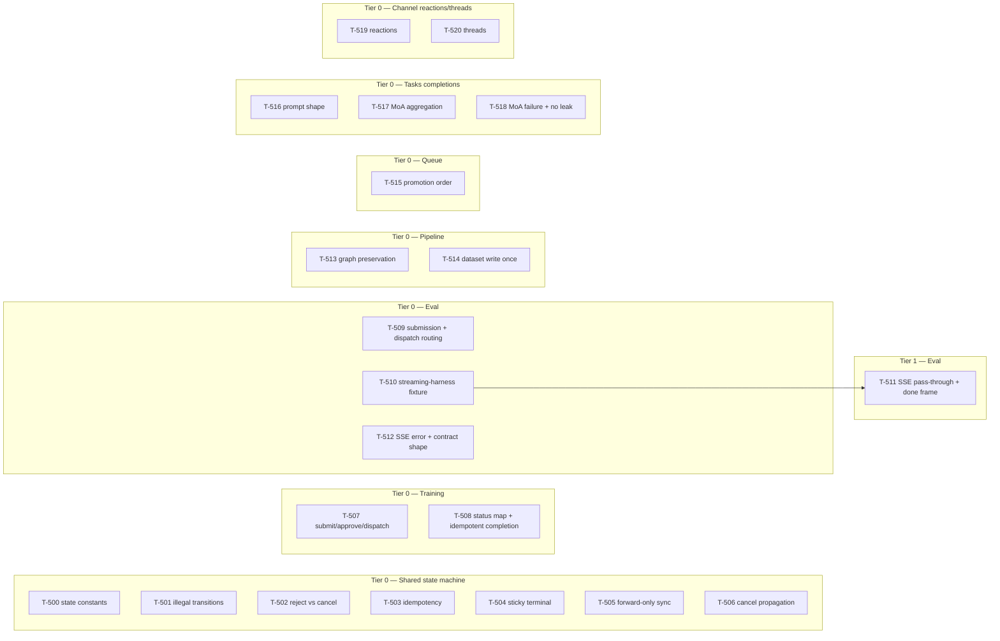

# Build Site: Job State Machines + Deferred Router Tests

Generated: 2026-04-12

Task IDs: T-500 through T-520 (21 tasks)
Tiers: 2 (Tier 0 = 20 tasks, Tier 1 = 1 task)
Source kits (scope notes in parentheses):
- `cavekit-ui-job-state-machines.md` — R1-R7, all 39 ACs in scope (NEW)
- `cavekit-ui-router-tests-jobs.md` — R4 only, all 9 ACs in scope (tightened 2026-04-12; drives T-R15)
- `cavekit-ui-router-tests-core-data.md` — R2 only, the 9 ACs appended 2026-04-12 (drives T-R17)

Total in-scope ACs: 57 (39 + 9 + 9)

Prerequisites (DONE from prior cycle, do NOT re-plan):
- `cavekit-ui-test-infrastructure.md` — conftest, fixtures, factories, `aioresponses_strict`, respx/responses mocks
- `cavekit-ui-security-tests.md` — auth + horizontal isolation
- Existing test files: `tests/routers/test_training.py`, `test_evaluations.py`, `test_tasks.py`, `test_channels.py` — EXTEND these; do not rebuild

Task-ID range starts at T-500 to avoid collision with the prior T-R## range and T-300..T-334 range.

Implementation-file targets (from the prior code survey, 2026-04-12):
- Training state code: `selfai_ui/routers/training.py`, `selfai_ui/utils/gpu_queue.py`
- Eval state + SSE: `selfai_ui/routers/evaluations.py` (SSE handler ~L1264-1347)
- Pipeline states: `selfai_ui/utils/gpu_queue.py`
- Tasks prompts: `selfai_ui/routers/tasks.py` + `selfai_ui/utils/task.py`
- Channel reactions/threads: `selfai_ui/routers/channels.py`, `selfai_ui/models/messages.py`

Expectation: some tasks may fail on the first run and surface a router bug rather than a test bug. That's the point of the cycle — failures go to `impl-review-findings.md` for a follow-up fix cycle; no retro-patching the test to match a wrong implementation.

---

## Tier 0 — No new fixture dependencies (all infrastructure + existing test files in place)

### Shared State Machine domain — R1, R2, R3 (T-500..T-506)

| Task | Title | Kit | Requirement (ACs) | blockedBy | Effort |
|------|-------|-----|-------------------|-----------|--------|
| T-500 | State-machine constants + transition matrix guard test — assert the canonical 7-state vocabulary and the transition table are what R1 says they are (code-level invariant test; pins the vocab before other tests rely on it) | state-machines | R1 (AC1-7) | -- | S |
| T-501 | Illegal-transition coverage across all transition endpoints for training, eval, and pipeline jobs — every non-allowed (from_state, endpoint) pair returns 4xx and does not mutate stored state | state-machines | R1 (AC8, AC9) | -- | L |
| T-502 | Reject-vs-cancel distinguishability test — rejecting a pending/scheduled job writes a rejection marker the job record exposes, separable from user-initiated cancel | state-machines | R1 (AC8); R2 (AC2) | -- | S |
| T-503 | Transition endpoint idempotency — cancel-already-cancelled is 2xx no-op; approve-pending/scheduled is 2xx; approve-from-any-other-state is 4xx no-op; cancel-from-completed/failed is 4xx no-op | state-machines | R2 (AC1, AC3, AC4) | -- | M |
| T-504 | Upstream sync sticky-terminal — local cancelled/completed/failed is not modified when upstream sync returns a different or non-terminal status (covers both Llamolotl and eval-harness mock paths) | state-machines | R3 (AC1, AC2) | -- | M |
| T-505 | Upstream sync forward-only — local non-terminal advances to match upstream running/completed/failed/cancelled; upstream 4xx/5xx/timeout leaves local state unchanged and returns an error-but-non-crashing status | state-machines | R3 (AC3, AC4) | -- | M |
| T-506 | Cancel propagation — cancelling a non-terminal job triggers an upstream cancel call (mock assertion) and local transitions to cancelled regardless of upstream response | state-machines | R3 (AC5) | -- | S |

### Training-specific lifecycle — R4 (T-507..T-508)

| Task | Title | Kit | Requirement (ACs) | blockedBy | Effort |
|------|-------|-----|-------------------|-----------|--------|
| T-507 | Training submit/approve/dispatch lifecycle — non-existent course is 4xx with no record, approve-pending/scheduled transitions to queued, dispatch issues Llamolotl submit (respx assertion) | state-machines | R4 (AC1, AC2) | -- | M |
| T-508 | Llamolotl status mapping coverage + idempotent-completion — every upstream status value maps into the documented shared-vocab state; repeated sync after completed is a no-op (state written exactly once) | state-machines | R4 (AC3, AC4) | -- | M |

### Eval-specific lifecycle — R5 (T-509..T-511)

| Task | Title | Kit | Requirement (ACs) | blockedBy | Effort |
|------|-------|-----|-------------------|-----------|--------|
| T-509 | Eval submission + harness dispatch routing — lm-eval/bigcode-eval with valid type creates a pending job with type recorded; unknown type is 4xx with no record; on dispatch the matching harness URL receives the request (mock assertion) | state-machines | R5 (AC1, AC2, AC3) | -- | M |
| T-510 | SSE streaming-harness fixture — a small test utility that yields a configurable sequence of JSON lines into the eval harness mock (used by T-511); lives under `tests/fixtures/` and is the only genuinely-new plumbing in this cycle | state-machines | R5 (supports AC4-7) | -- | S |
| T-512 | SSE error-and-contract-shape — harness mid-stream disconnect surfaces as an error-indicating frame (not HTTP error) then clean close; the SSE contract does not pin harness-specific JSON fields (asserted by passing two different payload shapes through the same test harness) | state-machines | R5 (AC6, AC7) | -- | S |

### Pipeline-specific lifecycle — R6 (T-513..T-514)

| Task | Title | Kit | Requirement (ACs) | blockedBy | Effort |
|------|-------|-----|-------------------|-----------|--------|
| T-513 | Pipeline node-graph preservation across states + shared-transition-table compliance — graph payload is parsed-JSON-equal at every observable state; R1 table applies with zero pipeline-specific exceptions | state-machines | R6 (AC1, AC2) | -- | M |
| T-514 | Pipeline dataset-write exactly-once + cancel-clean-output — running-to-completed triggers exactly one downstream dataset write (mock assertion on call count); repeated sync after completion does not re-trigger; cancelled-mid-run leaves no partial output | state-machines | R6 (AC3, AC4) | -- | M |

### GPU queue promotion ordering — R7 (T-515)

| Task | Title | Kit | Requirement (ACs) | blockedBy | Effort |
|------|-------|-----|-------------------|-----------|--------|
| T-515 | Queue promotion order — run_now beats high/normal; same-priority scheduled-due beats pending; same-priority-same-scheduling FIFO by created-at; run_now after dispatch does not preempt running; listing returns the exact dispatch order | state-machines | R7 (AC1-5) | -- | M |

### Tasks (Completions) tightened R4 — jobs kit (T-516..T-518)

| Task | Title | Kit | Requirement (ACs) | blockedBy | Effort |
|------|-------|-----|-------------------|-----------|--------|
| T-516 | Per-task prompt-shape tests — title/tag/query/emoji/autocompletion each produce a prompt containing a task-identifying substring and substituting the input; no template cross-contamination across all task pairs | jobs | R4 (AC1, AC2, AC6, AC9 single-call count) | -- | M |
| T-517 | MoA aggregation — happy-path N=1/3/5 includes every submitted response as a substring in submission order with no silent drops; exactly N upstream calls | jobs | R4 (AC3, AC5, AC9 MoA N-call count) | -- | M |
| T-518 | MoA partial-failure + error-without-leakage — 1-of-3 agent failure aggregates successes and names the failed agent distinctly; 4xx passthrough, 5xx/timeout → 500; response `detail` identifies the failing task and raw upstream body never appears in response bytes | jobs | R4 (AC4, AC7, AC8) | -- | M |

### Channel reactions + threads (appended R2 ACs) — core-data kit (T-519..T-520 + Tier 1 T-511)

| Task | Title | Kit | Requirement (ACs) | blockedBy | Effort |
|------|-------|-----|-------------------|-----------|--------|
| T-519 | Reaction idempotency + caller-scoping + remove-nonexistent + aggregated shape — same (user,message,name) twice is 2xx no-op with one row; removing caller's reaction leaves other users' intact; aggregated response groups by name with `user_ids`+`count` and no duplicate ids; removing a never-added reaction is 2xx no-op | core-data | R2 new-AC1,2,3,4 (the 4 reaction ACs appended 2026-04-12) | -- | M |
| T-520 | Flat-thread structure + grandchild rejection + reply listing + cascade and single-reply delete — reply has parent_id, root has parent_id=null; replying to a reply is 4xx with no new row; reply listing returns chronologically-ordered children only; deleting parent cascades to replies (reads 404); deleting single reply leaves parent and siblings intact | core-data | R2 new-AC5,6,7,8,9 (the 5 thread ACs appended 2026-04-12) | -- | M |

## Tier 1 — Depends on Tier 0 streaming fixture

| Task | Title | Kit | Requirement (ACs) | blockedBy | Effort |
|------|-------|-----|-------------------|-----------|--------|
| T-511 | SSE pass-through content-equality + terminal done-frame — N harness JSON lines in yield N `data: {json}\n\n` frames in order with parsed-JSON equality; final frame is `event: done\ndata: {json}` whose object includes the terminal status (completed, failed, or cancelled) | state-machines | R5 (AC4, AC5) | T-510 | M |

Note: T-511 is the only task that needs new fixture plumbing before it can run; the fixture lives in T-510. The SSE-error / contract-shape task (T-512) reuses the same fixture but is listed adjacent to T-510 above because content-equality (T-511) is what the fixture was built for; T-512 could be done against a simpler inline generator if T-510 slipped, so it's kept Tier 0 under an explicit "no hard blocker" read of the dep rules.

---

## Summary

| Domain | Tasks | Tier 0 | Tier 1 | Kit → R |
|--------|-------|--------|--------|---------|
| Shared state machine (R1-R3) | 7 | 7 | 0 | state-machines R1, R2, R3 |
| Training lifecycle (R4) | 2 | 2 | 0 | state-machines R4 |
| Eval lifecycle (R5) | 4 | 3 | 1 | state-machines R5 |
| Pipeline lifecycle (R6) | 2 | 2 | 0 | state-machines R6 |
| Queue ordering (R7) | 1 | 1 | 0 | state-machines R7 |
| Tasks completions (jobs R4) | 3 | 3 | 0 | jobs R4 |
| Channel reactions/threads (core-data R2 appended) | 2 | 2 | 0 | core-data R2 (new ACs only) |
| **Total** | **21** | **20** | **1** | |

Effort distribution: 1 L, 14 M, 6 S.

---

## Coverage Matrix

Every in-scope AC maps to at least one task. Scope reminder: for the jobs kit only R4 is in scope; for the core-data kit only the 9 ACs appended to R2 on 2026-04-12 are in scope.

### state-machines R1 — Shared State Vocabulary (10 ACs)

| AC | Summary | Task(s) |
|----|---------|---------|
| R1-AC1 | Canonical state set is exactly {pending, scheduled, queued, running, completed, failed, cancelled} | T-500 |
| R1-AC2 | pending → scheduled, queued, cancelled | T-500, T-501 |
| R1-AC3 | scheduled → pending, queued, cancelled | T-500, T-501 |
| R1-AC4 | queued → running, cancelled | T-500, T-501 |
| R1-AC5 | running → completed, failed, cancelled, cancelling | T-500, T-501 |
| R1-AC6 | cancelling → cancelled/completed/failed | T-500, T-501 |
| R1-AC7 | completed/failed/cancelled are terminal | T-500, T-501, T-503 |
| R1-AC8 | Reject transitions pending/scheduled into cancelled with a distinguishable rejection marker; no distinct "rejected" state | T-502 |
| R1-AC9 | Illegal transition returns 4xx and does not mutate stored state | T-501 |
| R1-AC10 | State after every transition matches table exactly | T-500, T-501, T-503 |

### state-machines R2 — Idempotency (4 ACs)

| AC | Summary | Task(s) |
|----|---------|---------|
| R2-AC1 | Cancel-already-cancelled is 2xx no-op | T-503 |
| R2-AC2 | Reject on terminal is 4xx no-op (also tied to reject marker) | T-502, T-503 |
| R2-AC3 | Approve pending/scheduled → 2xx queued; approve elsewhere → 4xx | T-503 |
| R2-AC4 | Cancel completed/failed → 4xx | T-503 |

### state-machines R3 — Upstream Sync Conflict Resolution (5 ACs)

| AC | Summary | Task(s) |
|----|---------|---------|
| R3-AC1 | Terminal local state immune to divergent upstream status | T-504 |
| R3-AC2 | Cancelled-local vs running-upstream: no rewind | T-504 |
| R3-AC3 | Non-terminal local advances to match upstream forward | T-505 |
| R3-AC4 | Upstream 4xx/5xx/timeout: local state unchanged, error-but-non-crashing | T-505 |
| R3-AC5 | Local cancel triggers upstream cancel call; local transition independent of upstream response | T-506 |

### state-machines R4 — Training Lifecycle (4 ACs)

| AC | Summary | Task(s) |
|----|---------|---------|
| R4-AC1 | Non-existent course → 4xx with no record | T-507 |
| R4-AC2 | Approve pending/scheduled → queued; dispatch issues Llamolotl submit | T-507 |
| R4-AC3 | Upstream Llamolotl status maps into shared vocab for every value | T-508 |
| R4-AC4 | Completion written exactly once; post-completion sync is no-op | T-508 |

### state-machines R5 — Eval Lifecycle + SSE (7 ACs)

| AC | Summary | Task(s) |
|----|---------|---------|
| R5-AC1 | Known-type eval creates pending job with type recorded | T-509 |
| R5-AC2 | Unknown-type eval → 4xx with no record | T-509 |
| R5-AC3 | Dispatch routes to matching harness URL | T-509 |
| R5-AC4 | SSE pass-through: N JSON lines → N `data:` frames, order + parsed-JSON equality | T-511 (requires T-510 fixture) |
| R5-AC5 | Final `event: done` frame with terminal status in JSON | T-511 |
| R5-AC6 | Harness mid-stream disconnect → error-indicating frame, clean close | T-512 |
| R5-AC7 | SSE contract does not pin harness-specific JSON fields | T-512 |

### state-machines R6 — Pipeline Lifecycle (4 ACs)

| AC | Summary | Task(s) |
|----|---------|---------|
| R6-AC1 | Node-graph payload parsed-JSON-equal across all states | T-513 |
| R6-AC2 | Shared R1 table applies to pipeline without exceptions | T-513 |
| R6-AC3 | Dataset write exactly once on running→completed; no retrigger on redundant sync | T-514 |
| R6-AC4 | Cancel mid-run leaves no partial output | T-514 |

### state-machines R7 — Queue Promotion (5 ACs)

| AC | Summary | Task(s) |
|----|---------|---------|
| R7-AC1 | run_now beats high/normal | T-515 |
| R7-AC2 | Same priority: scheduled-due beats pending | T-515 |
| R7-AC3 | Same priority + same scheduling: FIFO by created_at | T-515 |
| R7-AC4 | run_now after dispatch does not preempt running | T-515 |
| R7-AC5 | Listed order equals dispatch order | T-515 |

### jobs R4 — Tasks Completions (9 ACs, all in scope)

| AC | Summary | Task(s) |
|----|---------|---------|
| R4-AC1 | Each non-MoA task receives prompt with task-identifying substring + substituted input | T-516 |
| R4-AC2 | No template cross-contamination across all task pairs | T-516 |
| R4-AC3 | MoA with N agents contains every submitted response as substring in submission order | T-517 |
| R4-AC4 | MoA 1-of-3 failure: successes aggregated; failed agent identified distinctly; call does not fail wholesale | T-518 |
| R4-AC5 | MoA N ∈ {1, 3, 5} | T-517 |
| R4-AC6 | Non-MoA response body pass-through unchanged | T-516 |
| R4-AC7 | 4xx pass-through; 5xx/timeout → 500 | T-518 |
| R4-AC8 | Error `detail` names failing task; raw upstream body not in response bytes | T-518 |
| R4-AC9 | Single task = 1 upstream call; MoA N agents = N upstream calls | T-516 (single) + T-517 (MoA) |

### core-data R2 — Channel CRUD appended ACs (9 new ACs, in scope)

Numbered by order appended on 2026-04-12 for traceability. Original numbering in the kit file places these as AC14-22.

| AC | Summary (appended 2026-04-12) | Task(s) |
|----|------------------------------|---------|
| new-AC1 (kit AC14) | Same user + same name + same message twice: one row, second call 2xx no-op | T-519 |
| new-AC2 (kit AC15) | Caller-scoped removal: removing caller's reaction leaves other users' intact | T-519 |
| new-AC3 (kit AC16) | Aggregated response: one entry per name with user_ids + count, no duplicate ids within a name | T-519 |
| new-AC4 (kit AC17) | Remove-nonexistent reaction: 2xx no-op (not 404), store unchanged | T-519 |
| new-AC5 (kit AC18) | Reply has non-null parent_id; thread root has parent_id=null | T-520 |
| new-AC6 (kit AC19) | Reply-to-a-reply is 4xx; no grandchildren ever | T-520 |
| new-AC7 (kit AC20) | Reply listing: children only, chronological, parent excluded | T-520 |
| new-AC8 (kit AC21) | Cascade delete: parent delete removes all replies; reads of deleted reply ids return 404 | T-520 |
| new-AC9 (kit AC22) | Single-reply delete: only that reply is removed; parent + siblings intact | T-520 |

### Coverage summary

- state-machines R1: 10/10 AC covered
- state-machines R2: 4/4 AC covered
- state-machines R3: 5/5 AC covered
- state-machines R4: 4/4 AC covered
- state-machines R5: 7/7 AC covered
- state-machines R6: 4/4 AC covered
- state-machines R7: 5/5 AC covered
- jobs R4: 9/9 AC covered
- core-data R2 (new ACs only): 9/9 AC covered

**Total: 57/57 (100%) — no gaps.**

---

## Dependency Graph

Parallelization: 20 of 21 tasks start in Tier 0 with no inter-task edges. T-511 is the only dependent task; it waits on T-510 (the SSE streaming-harness fixture). All other tasks fan out in full parallel from the already-landed infrastructure.
