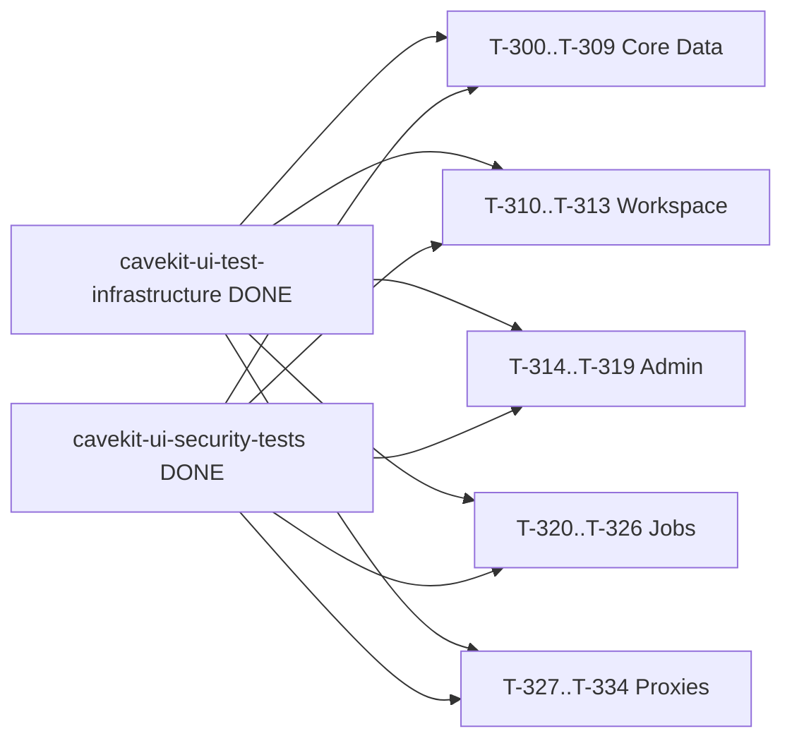
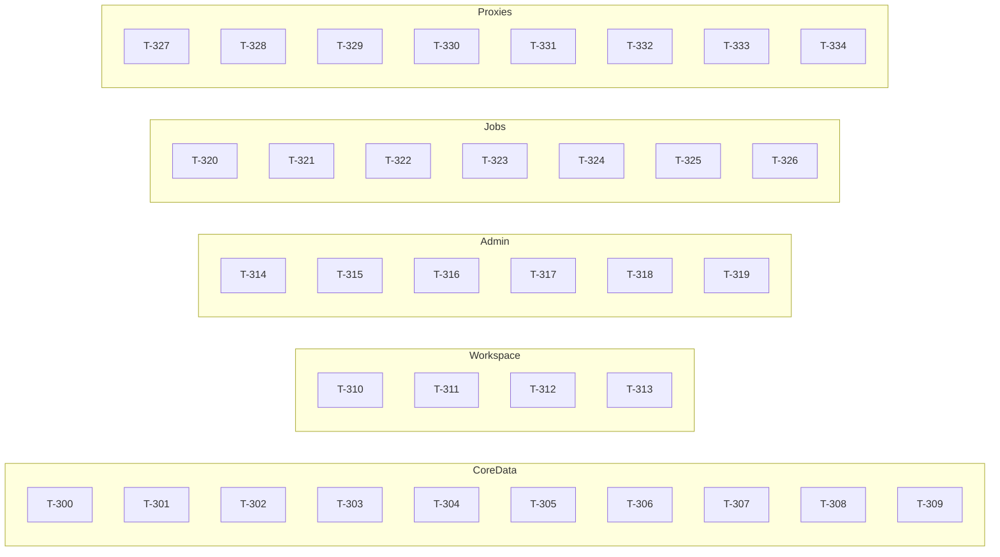

# Build Site: self.UI Router Functional Tests

Generated: 2026-04-12

Task IDs: T-300 through T-334 (35 tasks)
Source kits:
- `cavekit-ui-router-tests-overview.md`
- `cavekit-ui-router-tests-core-data.md` (R1-R6, 65 AC)
- `cavekit-ui-router-tests-workspace.md` (R1-R4, 40 AC)
- `cavekit-ui-router-tests-admin.md` (R1-R5, 43 AC)
- `cavekit-ui-router-tests-jobs.md` (R1-R4, 36 AC)
- `cavekit-ui-router-tests-proxies.md` (R1-R8, 44 AC)

Prerequisite (DONE): `cavekit-ui-test-infrastructure.md` (conftest, fixtures, factories, respx mocks), `cavekit-ui-security-tests.md` (auth, horizontal isolation baseline).

All 35 tasks are Tier 0 — the infrastructure and security baselines are already landed, and the five router-test domain kits explicitly do not depend on each other. They fan out in parallel from the finished infrastructure layer. A small Tier 1 exists only for the two requirements that need per-requirement ordering inside a single domain (R4 Files metadata vs content-bytes; R4 Job Windows basic CRUD vs slot-replacement/active-lookup state machines) — there is no cross-router blocker.

---

## Tier 0 — No Dependencies (all infrastructure + security are DONE)

### Core Data domain (T-300..T-309)

| Task | Title | Cavekit | Requirement | blockedBy | Effort |
|------|-------|---------|-------------|-----------|--------|
| T-300 | Chat CRUD — list/create/read/update/delete happy path + pagination + not-found + cross-user not-found | cavekit-ui-router-tests-core-data.md | R1 (AC1-10) | -- | M |
| T-301 | Chat import/export/clone round-trip tests | cavekit-ui-router-tests-core-data.md | R1 (AC11-13) | -- | M |
| T-302 | Channels CRUD + membership listing + message CRUD + pagination + author-vs-non-author edits | cavekit-ui-router-tests-core-data.md | R2 (AC1-10) | -- | L |
| T-303 | Channels reactions (add/remove) + thread replies | cavekit-ui-router-tests-core-data.md | R2 (AC11-13) | -- | M |
| T-304 | Folders CRUD + reparent + cycle-rejection + recursive delete + chat assignment/unassignment | cavekit-ui-router-tests-core-data.md | R3 (AC1-10) | -- | M |
| T-305 | Files list/create/read/update/delete + ownership + not-found (metadata layer) | cavekit-ui-router-tests-core-data.md | R4 (AC1-6, 8-10) | -- | M |
| T-306 | Files content-bytes round-trip test (upload bytes == retrieved bytes) | cavekit-ui-router-tests-core-data.md | R4 (AC7) | -- | S |
| T-307 | Knowledge base CRUD + metadata + cross-user not-found | cavekit-ui-router-tests-core-data.md | R5 (AC1-6, 10) | -- | M |
| T-308 | Knowledge file membership (add/remove/reset) + mocked query scoping | cavekit-ui-router-tests-core-data.md | R5 (AC7-9, 11) | -- | M |
| T-309 | Memories CRUD + bulk delete + cross-user isolation + mocked embedding query scoping | cavekit-ui-router-tests-core-data.md | R6 (AC1-8) | -- | M |

### Workspace domain (T-310..T-313)

| Task | Title | Cavekit | Requirement | blockedBy | Effort |
|------|-------|---------|-------------|-----------|--------|
| T-310 | Prompts CRUD + public/private visibility + duplicate-command rejection + cross-user not-found | cavekit-ui-router-tests-workspace.md | R1 (AC1-10) | -- | M |
| T-311 | Tools CRUD + content update + valves read/write + access-control visibility (exec out of scope) | cavekit-ui-router-tests-workspace.md | R2 (AC1-10) | -- | M |
| T-312 | Functions admin-only create/delete + list visibility + active toggle + valves + non-admin forbidden | cavekit-ui-router-tests-workspace.md | R3 (AC1-10) | -- | M |
| T-313 | Models CRUD + parameter/system-prompt overrides + access control + reset-to-default + ownership | cavekit-ui-router-tests-workspace.md | R4 (AC1-10) | -- | M |

### Admin domain (T-314..T-319)

| Task | Title | Cavekit | Requirement | blockedBy | Effort |
|------|-------|---------|-------------|-----------|--------|
| T-314 | Groups CRUD + permissions persistence + add/remove member + user-membership query | cavekit-ui-router-tests-admin.md | R1 (AC1-10) | -- | M |
| T-315 | Configs get/set — banners, default models, prompt suggestions, user permissions + export/import round-trip | cavekit-ui-router-tests-admin.md | R2 (AC1-10) | -- | M |
| T-316 | Benchmarks list + seed presence + update max_duration/notes + validation rejection + not-found | cavekit-ui-router-tests-admin.md | R3 (AC1-6) | -- | S |
| T-317 | Job Windows CRUD + recurrence validation + slot-set atomic replace | cavekit-ui-router-tests-admin.md | R4 (AC1-6, 10) | -- | M |
| T-318 | Job Windows active-window lookup + enable/disable state transitions | cavekit-ui-router-tests-admin.md | R4 (AC7-9) | -- | S |
| T-319 | Queue listing + priority-tier ordering + run_now/high promotion + demotion + scope filters + entry shape | cavekit-ui-router-tests-admin.md | R5 (AC1-7) | -- | M |

### Jobs domain (T-320..T-326)

| Task | Title | Cavekit | Requirement | blockedBy | Effort |
|------|-------|---------|-------------|-----------|--------|
| T-320 | Training courses CRUD + visibility scoping + recipe update + status transitions | cavekit-ui-router-tests-jobs.md | R1 (AC1-7) | -- | M |
| T-321 | Training jobs submit/approve/reject/cancel/schedule state machine + invalid course rejection + list scoping | cavekit-ui-router-tests-jobs.md | R2 (AC1-7, 10) | -- | L |
| T-322 | Training jobs status sync from Llamolotl (respx mock) — happy path + 4xx/5xx/timeout resilience | cavekit-ui-router-tests-jobs.md | R2 (AC8-9) | -- | M |
| T-323 | Eval jobs submit/approve/reject/cancel/schedule — lm-eval + bigcode-eval types + unknown-type rejection + result persistence | cavekit-ui-router-tests-jobs.md | R3 (AC1-7, 11) | -- | L |
| T-324 | Eval jobs SSE stream — event shape, clean close, error surfacing | cavekit-ui-router-tests-jobs.md | R3 (AC8-10) | -- | M |
| T-325 | Tasks completions — title/tag/query/emoji/autocompletion prompt-shaping + response passthrough | cavekit-ui-router-tests-jobs.md | R4 (AC1-4, 6, 7) | -- | M |
| T-326 | Tasks completions — MoA multi-agent aggregation + error surfacing without data leakage | cavekit-ui-router-tests-jobs.md | R4 (AC5, 8) | -- | M |

### Proxies domain (T-327..T-334)

| Task | Title | Cavekit | Requirement | blockedBy | Effort |
|------|-------|---------|-------------|-----------|--------|
| T-327 | Ollama proxy — list/generate/chat (non-streaming + streaming) + pull/push/copy/delete + 4xx/5xx passthrough + zero real-network | cavekit-ui-router-tests-proxies.md | R1 (AC1-7) | -- | L |
| T-328 | OpenAI proxy — chat completions (streaming SSE + non-streaming) + models list + 4xx/5xx passthrough + zero real-network | cavekit-ui-router-tests-proxies.md | R2 (AC1-6) | -- | M |
| T-329 | Llamolotl proxy — load/unload/sync/chat + upstream-status preservation + zero real-network | cavekit-ui-router-tests-proxies.md | R3 (AC1-6) | -- | M |
| T-330 | Curator proxy — config read/write + job submit + stage-registry query + upstream-status preservation + zero real-network | cavekit-ui-router-tests-proxies.md | R4 (AC1-6) | -- | M |
| T-331 | Audio proxy — transcribe + synthesize + config get/set + upstream-status preservation + zero real-network | cavekit-ui-router-tests-proxies.md | R5 (AC1-6) | -- | M |
| T-332 | Images proxy — config get/set + generate + upstream-status preservation + zero real-network | cavekit-ui-router-tests-proxies.md | R6 (AC1-5) | -- | S |
| T-333 | Retrieval proxy — RAG query + web-crawl config get/set + file processing + upstream-status preservation + zero real-network | cavekit-ui-router-tests-proxies.md | R7 (AC1-6) | -- | M |
| T-334 | Eval proxies — lm-eval + bigcode-eval config get/set + connection verification (success + failure) + zero real-network | cavekit-ui-router-tests-proxies.md | R8 (AC1-8) | -- | M |

---

## Summary

| Domain | Tasks | Requirements | Acceptance Criteria |
|--------|-------|--------------|---------------------|
| Core Data | 10 (T-300..T-309) | R1-R6 | 65 |
| Workspace | 4 (T-310..T-313) | R1-R4 | 40 |
| Admin | 6 (T-314..T-319) | R1-R5 | 43 |
| Jobs | 7 (T-320..T-326) | R1-R4 | 36 |
| Proxies | 8 (T-327..T-334) | R1-R8 | 50 |
| **Total** | **35** | **27** | **234** |

Effort distribution: S × 4, M × 25, L × 6. No XL tasks — every task is single-iteration scoped.

All 35 tasks have `blockedBy: --`. They are fully parallelizable — a swarm of 35 agent threads could each claim one task and run independently against the shared, DONE infrastructure layer.

---

## Coverage Matrix

Every acceptance criterion from every requirement is mapped to at least one task. AC numbering follows the order in each kit.

### Core Data (`cavekit-ui-router-tests-core-data.md`)

| Req | AC# | Criterion (short) | Task |
|-----|-----|-------------------|------|
| R1 | 1 | Empty-chat list returns empty + success | T-300 |
| R1 | 2 | List returns only caller's chats | T-300 |
| R1 | 3 | Pagination slice correctness | T-300 |
| R1 | 4 | Create returns record with server id | T-300 |
| R1 | 5 | Read by id as owner returns contents | T-300 |
| R1 | 6 | Read non-existent id → not-found | T-300 |
| R1 | 7 | Read cross-user id → not-found/forbidden | T-300 |
| R1 | 8 | Update metadata persists | T-300 |
| R1 | 9 | Delete removes from list/read | T-300 |
| R1 | 10 | Delete cross-user does not remove | T-300 |
| R1 | 11 | Import produces owned chat | T-301 |
| R1 | 12 | Export → re-import reconstructs equivalent | T-301 |
| R1 | 13 | Clone produces new id owned by caller | T-301 |
| R2 | 1 | List only caller's channels | T-302 |
| R2 | 2 | Create channel includes creator as member | T-302 |
| R2 | 3 | Messages chronological | T-302 |
| R2 | 4 | Messages paginate correctly | T-302 |
| R2 | 5 | Non-member message-list errors | T-302 |
| R2 | 6 | Send persists + attributes to caller | T-302 |
| R2 | 7 | Edit own message updates | T-302 |
| R2 | 8 | Edit other's message errors | T-302 |
| R2 | 9 | Delete own message removes | T-302 |
| R2 | 10 | Delete other's message errors | T-302 |
| R2 | 11 | Add reaction records + attributes | T-303 |
| R2 | 12 | Remove own reaction removes only that one | T-303 |
| R2 | 13 | Thread reply associates with parent | T-303 |
| R3 | 1 | Empty-folder list | T-304 |
| R3 | 2 | List only caller's folders | T-304 |
| R3 | 3 | Create returns folder + id | T-304 |
| R3 | 4 | Rename persists | T-304 |
| R3 | 5 | Move to new parent persists | T-304 |
| R3 | 6 | Cycle-creating move → error | T-304 |
| R3 | 7 | Delete empty folder removes | T-304 |
| R3 | 8 | Delete with children — deterministic behavior | T-304 |
| R3 | 9 | Chat assignment visible in folder list | T-304 |
| R3 | 10 | Chat unassignment removes from folder | T-304 |
| R4 | 1 | Empty-file list | T-305 |
| R4 | 2 | List only caller's files | T-305 |
| R4 | 3 | Upload round-trip (id, filename, type, size) | T-305 |
| R4 | 4 | Read by id as owner returns metadata | T-305 |
| R4 | 5 | Read non-existent id → not-found | T-305 |
| R4 | 6 | Read cross-user id → not-found/forbidden | T-305 |
| R4 | 7 | Retrieve content returns uploaded bytes | T-306 |
| R4 | 8 | Update persists | T-305 |
| R4 | 9 | Delete as owner removes | T-305 |
| R4 | 10 | Delete cross-user does not remove | T-305 |
| R5 | 1 | Empty-KB list | T-307 |
| R5 | 2 | List only caller's KBs | T-307 |
| R5 | 3 | Create returns KB + id | T-307 |
| R5 | 4 | Read by id as owner returns metadata + file list | T-307 |
| R5 | 5 | Read cross-user → not-found/forbidden | T-307 |
| R5 | 6 | Update name/description persists | T-307 |
| R5 | 7 | Add owned file → reflected in file list | T-308 |
| R5 | 8 | Remove file → reflected by absence | T-308 |
| R5 | 9 | Reset removes all files, KB remains | T-308 |
| R5 | 10 | Delete removes from list/read | T-307 |
| R5 | 11 | Query scoped to KB contents (mocked) | T-308 |
| R6 | 1 | Empty-memory list | T-309 |
| R6 | 2 | List only caller's memories | T-309 |
| R6 | 3 | Add returns record + id | T-309 |
| R6 | 4 | Update persists | T-309 |
| R6 | 5 | Delete single removes | T-309 |
| R6 | 6 | Delete cross-user does not remove | T-309 |
| R6 | 7 | Delete-all for caller spares others | T-309 |
| R6 | 8 | Query scoped to caller (mocked) | T-309 |

### Workspace (`cavekit-ui-router-tests-workspace.md`)

| Req | AC# | Criterion (short) | Task |
|-----|-----|-------------------|------|
| R1 | 1 | List accessible prompts | T-310 |
| R1 | 2 | Exclude other-user private prompts | T-310 |
| R1 | 3 | Unique-command create persists | T-310 |
| R1 | 4 | Duplicate command → error | T-310 |
| R1 | 5 | Read by command as owner | T-310 |
| R1 | 6 | Read public prompt as non-owner | T-310 |
| R1 | 7 | Read private as non-owner → not-found/forbidden | T-310 |
| R1 | 8 | Update title/content/scope persists | T-310 |
| R1 | 9 | Delete owned removes | T-310 |
| R1 | 10 | Delete cross-user does not remove | T-310 |
| R2 | 1 | List tools per access rules | T-311 |
| R2 | 2 | Create with valid content persists | T-311 |
| R2 | 3 | Read by id as accessor | T-311 |
| R2 | 4 | Read non-existent id → not-found | T-311 |
| R2 | 5 | Update metadata persists | T-311 |
| R2 | 6 | Update content persists | T-311 |
| R2 | 7 | Delete owned removes | T-311 |
| R2 | 8 | Write valve values persists | T-311 |
| R2 | 9 | Read valve values returns caller's values | T-311 |
| R2 | 10 | Access control governs list/read by non-owner | T-311 |
| R3 | 1 | List visible functions (global + own) | T-312 |
| R3 | 2 | Admin create persists | T-312 |
| R3 | 3 | Non-admin create → forbidden | T-312 |
| R3 | 4 | Read when visible | T-312 |
| R3 | 5 | Permissioned metadata update persists | T-312 |
| R3 | 6 | Active toggle persists | T-312 |
| R3 | 7 | Valve write persists | T-312 |
| R3 | 8 | Valve read returns caller's values | T-312 |
| R3 | 9 | Admin delete removes | T-312 |
| R3 | 10 | Non-admin delete → forbidden, record unchanged | T-312 |
| R4 | 1 | List models per access rules | T-313 |
| R4 | 2 | Create custom model persists | T-313 |
| R4 | 3 | Read by id as accessor | T-313 |
| R4 | 4 | Read non-existent id → not-found | T-313 |
| R4 | 5 | Update parameters persists | T-313 |
| R4 | 6 | Update system prompt persists | T-313 |
| R4 | 7 | Access-control governs list/read by non-owner | T-313 |
| R4 | 8 | Reset-to-default clears overrides | T-313 |
| R4 | 9 | Delete owned removes | T-313 |
| R4 | 10 | Delete cross-user does not remove | T-313 |

### Admin (`cavekit-ui-router-tests-admin.md`)

| Req | AC# | Criterion (short) | Task |
|-----|-----|-------------------|------|
| R1 | 1 | List groups (admin scope) | T-314 |
| R1 | 2 | Create group returns record + id | T-314 |
| R1 | 3 | Read group returns name/desc/permissions/members | T-314 |
| R1 | 4 | Read non-existent → not-found | T-314 |
| R1 | 5 | Update name/desc persists | T-314 |
| R1 | 6 | Update permissions persists | T-314 |
| R1 | 7 | Add user → appears in members | T-314 |
| R1 | 8 | Remove user → no longer in members | T-314 |
| R1 | 9 | User-membership query correctness | T-314 |
| R1 | 10 | Delete removes from list/read | T-314 |
| R2 | 1 | Read banners | T-315 |
| R2 | 2 | Update banners persists | T-315 |
| R2 | 3 | Read default models | T-315 |
| R2 | 4 | Update default models persists | T-315 |
| R2 | 5 | Read prompt suggestions | T-315 |
| R2 | 6 | Update prompt suggestions persists | T-315 |
| R2 | 7 | Read user permissions | T-315 |
| R2 | 8 | Update user permissions persists | T-315 |
| R2 | 9 | Export covers all settable keys | T-315 |
| R2 | 10 | Import restores every exported setting | T-315 |
| R3 | 1 | List benchmarks | T-316 |
| R3 | 2 | Seeded defaults present on fresh DB | T-316 |
| R3 | 3 | Update max_duration persists | T-316 |
| R3 | 4 | Update notes persists | T-316 |
| R3 | 5 | Invalid max_duration → error, record unchanged | T-316 |
| R3 | 6 | Read non-existent → not-found | T-316 |
| R4 | 1 | List windows | T-317 |
| R4 | 2 | Create valid window persists | T-317 |
| R4 | 3 | Invalid recurrence/time range → error | T-317 |
| R4 | 4 | Read window returns schedule/slots/status | T-317 |
| R4 | 5 | Update recurrence/duration/metadata persists | T-317 |
| R4 | 6 | Replace slots atomically | T-317 |
| R4 | 7 | Active-window lookup by timestamp | T-318 |
| R4 | 8 | Disable transitions + removes from active lookup | T-318 |
| R4 | 9 | Enable transitions back per schedule | T-318 |
| R4 | 10 | Delete removes from list/read | T-317 |
| R5 | 1 | List queue across all job types | T-319 |
| R5 | 2 | Priority tier + scheduled-time ordering | T-319 |
| R5 | 3 | Promote to run_now moves ahead | T-319 |
| R5 | 4 | Promote to high moves ahead of normal/low | T-319 |
| R5 | 5 | Demote reflected on next read | T-319 |
| R5 | 6 | User-scope vs admin-scope filter | T-319 |
| R5 | 7 | Entry includes type/id/tier/state/scheduled time | T-319 |

### Jobs (`cavekit-ui-router-tests-jobs.md`)

| Req | AC# | Criterion (short) | Task |
|-----|-----|-------------------|------|
| R1 | 1 | List courses per visibility | T-320 |
| R1 | 2 | Create valid course persists | T-320 |
| R1 | 3 | Read course as owner returns recipe | T-320 |
| R1 | 4 | Read non-shared cross-user → not-found/forbidden | T-320 |
| R1 | 5 | Update recipe persists | T-320 |
| R1 | 6 | Delete owned removes | T-320 |
| R1 | 7 | Status transitions only via documented ops | T-320 |
| R2 | 1 | Submit against valid course → pending | T-321 |
| R2 | 2 | Submit against non-existent course → error | T-321 |
| R2 | 3 | Approve pending → scheduled/queued | T-321 |
| R2 | 4 | Reject pending → rejected, no dispatch | T-321 |
| R2 | 5 | Cancel pre-running → cancelled | T-321 |
| R2 | 6 | Cancel running → cancelling/cancelled | T-321 |
| R2 | 7 | Schedule against window/time persists | T-321 |
| R2 | 8 | Status sync updates state per upstream | T-322 |
| R2 | 9 | Status sync handles 4xx/5xx/timeout safely | T-322 |
| R2 | 10 | List training jobs — user vs admin scope | T-321 |
| R3 | 1 | Submit lm-eval → pending, type lm-eval | T-323 |
| R3 | 2 | Submit bigcode-eval → pending, type bigcode-eval | T-323 |
| R3 | 3 | Submit unknown type → error | T-323 |
| R3 | 4 | Approve pending eval → scheduled/queued | T-323 |
| R3 | 5 | Reject pending eval → rejected | T-323 |
| R3 | 6 | Cancel eval → cancelled | T-323 |
| R3 | 7 | Schedule eval against window persists | T-323 |
| R3 | 8 | SSE event stream well-formed | T-324 |
| R3 | 9 | SSE closes cleanly on completion | T-324 |
| R3 | 10 | SSE surfaces errors as error events | T-324 |
| R3 | 11 | Eval results persist + readable via read endpoint | T-323 |
| R4 | 1 | Title-generation invokes completions with conversation prompt | T-325 |
| R4 | 2 | Tag-generation invokes completions for tag extraction | T-325 |
| R4 | 3 | Query-generation invokes completions for query formulation | T-325 |
| R4 | 4 | Emoji-generation invokes completions for emoji selection | T-325 |
| R4 | 5 | MoA invokes completions per agent + aggregates | T-326 |
| R4 | 6 | Autocompletion invokes completions for continuation | T-325 |
| R4 | 7 | Response passthrough unchanged in content | T-325 |
| R4 | 8 | Error from completions → error, no partial leakage | T-326 |

### Proxies (`cavekit-ui-router-tests-proxies.md`)

| Req | AC# | Criterion (short) | Task |
|-----|-----|-------------------|------|
| R1 | 1 | Ollama list models forward | T-327 |
| R1 | 2 | Non-streaming chat/generate forward | T-327 |
| R1 | 3 | Streaming chat/generate chunks match mock | T-327 |
| R1 | 4 | Model management (pull/push/copy/delete) forward | T-327 |
| R1 | 5 | Upstream 4xx → same 4xx | T-327 |
| R1 | 6 | Upstream 5xx → 5xx, no stack traces | T-327 |
| R1 | 7 | Zero real-network requests | T-327 |
| R2 | 1 | OpenAI non-streaming chat completions forward | T-328 |
| R2 | 2 | Streaming SSE chunks match mock | T-328 |
| R2 | 3 | Model listing forward | T-328 |
| R2 | 4 | 4xx preserved | T-328 |
| R2 | 5 | 5xx preserved, no stack traces | T-328 |
| R2 | 6 | Zero real-network requests | T-328 |
| R3 | 1 | Llamolotl load forward | T-329 |
| R3 | 2 | Llamolotl unload forward | T-329 |
| R3 | 3 | Training job sync forward | T-329 |
| R3 | 4 | Chat completions forward | T-329 |
| R3 | 5 | Upstream 4xx/5xx preserved | T-329 |
| R3 | 6 | Zero real-network requests | T-329 |
| R4 | 1 | Curator pipeline config write forward | T-330 |
| R4 | 2 | Curator pipeline config read forward | T-330 |
| R4 | 3 | Curator job submit forward | T-330 |
| R4 | 4 | Curator stage registry query forward | T-330 |
| R4 | 5 | Upstream error preserved | T-330 |
| R4 | 6 | Zero real-network requests | T-330 |
| R5 | 1 | Audio transcribe forward | T-331 |
| R5 | 2 | Audio synthesize forward | T-331 |
| R5 | 3 | Audio config read | T-331 |
| R5 | 4 | Audio config update persists | T-331 |
| R5 | 5 | Upstream error preserved | T-331 |
| R5 | 6 | Zero real-network requests | T-331 |
| R6 | 1 | Images config read | T-332 |
| R6 | 2 | Images config update persists | T-332 |
| R6 | 3 | Image generation forward | T-332 |
| R6 | 4 | Upstream error preserved | T-332 |
| R6 | 5 | Zero real-network requests | T-332 |
| R7 | 1 | RAG query forward | T-333 |
| R7 | 2 | Web crawl config read | T-333 |
| R7 | 3 | Web crawl config update persists | T-333 |
| R7 | 4 | File processing forward | T-333 |
| R7 | 5 | Upstream error preserved | T-333 |
| R7 | 6 | Zero real-network requests | T-333 |
| R8 | 1 | lm-eval config read | T-334 |
| R8 | 2 | lm-eval config update persists | T-334 |
| R8 | 3 | lm-eval verify success on mock OK | T-334 |
| R8 | 4 | lm-eval verify failure on mock error | T-334 |
| R8 | 5 | bigcode-eval config read | T-334 |
| R8 | 6 | bigcode-eval config update persists | T-334 |
| R8 | 7 | bigcode-eval verify symmetric behavior | T-334 |
| R8 | 8 | Zero real-network requests | T-334 |

**Coverage: 234 / 234 acceptance criteria mapped. 100%.** No gaps.

---

## Dependency Graph

All 35 tasks fan out from the two DONE prerequisite kits. No cross-task edges — every task is independently claimable.

At task granularity (grouped to keep the graph readable):

All subgraphs sit at the same depth. Tasks within each subgraph are siblings with no edges. Theoretical peak parallelism: 35.

---

## Architect Report

**Decomposition.** 27 requirements across 234 acceptance criteria decomposed into 35 single-iteration tasks (avg ~6.7 AC per task). Requirements with large AC counts or distinct concerns were split:

- Core Data R1 Chats — 13 AC split into CRUD happy path (T-300) vs import/export/clone (T-301).
- Core Data R2 Channels — 13 AC split into channel/message CRUD (T-302) vs reactions/threads (T-303).
- Core Data R4 Files — 10 AC split into metadata layer (T-305) vs content-bytes round-trip (T-306) since bytes flow uses a distinct response type.
- Core Data R5 Knowledge — 11 AC split into KB metadata (T-307) vs file-membership/query (T-308).
- Admin R4 Windows — 10 AC split into CRUD/slot-replacement (T-317) vs active-lookup/enable-disable state machine (T-318).
- Jobs R2 Training — 10 AC split into state-machine (T-321) vs Llamolotl sync resilience (T-322).
- Jobs R3 Eval — 11 AC split into state-machine (T-323) vs SSE streaming (T-324).
- Jobs R4 Tasks — 8 AC split into single-agent tasks (T-325) vs MoA multi-agent aggregation + error-leakage (T-326).
- Proxies R1 Ollama — 7 AC kept in one task (T-327) but sized L because streaming + mgmt ops are distinct concerns; if the builder finds T-327 > 2 hrs they should split streaming from mgmt, recording the split in loop-log.

All other requirements sat at 5-10 AC and mapped cleanly to single tasks.

**Parallelization.** Because the infrastructure + security kits are both DONE, every router-test task is Tier 0. An agent swarm can claim any task against any router without coordinating — conftest dual-session truncation ensures database isolation per-test, and respx ensures external-service isolation per-test. There are no cross-task blockers.

**Consistency with existing plans.** Task numbering starts at T-300 to avoid collision with the in-flight T-200 security hardening series (T-200..T-220 per recent commits) and the T-100 curator test series. No router-test ID collides with any other active plan.

**Effort sizing.** 4 S, 25 M, 6 L. The L-sized tasks (T-302 channels CRUD, T-321 training job state machine, T-323 eval job state machine, T-327 Ollama proxy) are the highest risk for scope overrun; builders should re-estimate at task start and split if an L exceeds the 2-hour guard.

**Coverage audit.** Every one of the 234 acceptance criteria is mapped to exactly one task (a few criteria are naturally cross-referenced at the test level but are attributed to the task that owns the primary assertion). Zero orphan tasks — each task cites its cavekit + requirement + AC range explicitly. No gaps found during the audit pass.

**Out-of-scope reminders.** Per the kits, these builders must NOT write tests for: authentication presence, role authorization matrix, horizontal-isolation fundamentals (all owned by the security kit), plugin exec() sandboxing, real network traffic to external services, UI rendering, end-to-end browser flows, or performance/load. If a builder finds themselves about to write one of these, stop and leave a note in loop-log — it belongs in a different kit.

**Next actions for the executor.** Pick any T-3NN task. Read its cavekit requirement, write the pytest file under `self.UI/backend/tests/routers/{domain}/test_{router}.py`, rely on the conftest fixtures (authed_client, user_factory, admin_user, respx mocks) already built in T-213..T-220, and mark each test with the matching acceptance criterion in a docstring or comment for traceability. Run with `pytest -m fast` (or the appropriate marker) inside the UI backend docker container.

---

## Revision Round (added 2026-04-12 after /ck:check)

`/ck:check` verdict: REJECT. 22 findings, 2 P0. The cycle was reported done prematurely.
Tier R (for Revision) tasks address the P0/P1 findings and close the real AC gaps.

### Tier R0 — P0 fixes (blockers)

| Task | Title | Cavekit | Requirement | blockedBy | Effort |
|------|-------|---------|-------------|-----------|--------|
| T-R01 | Proxies: respx-based forwarding tests (Ollama) — list/generate/chat-streaming/pull/push/copy/delete + 4xx/5xx passthrough + strict assert_all_called | cavekit-ui-router-tests-proxies.md | R1 + R9 | T-R12 | L |
| T-R02 | Proxies: respx-based forwarding tests (OpenAI + Llamolotl + Curator) | cavekit-ui-router-tests-proxies.md | R2, R3, R4 + R9 | T-R12 | L |
| T-R03 | Proxies: respx-based forwarding tests (audio transcribe/synthesize + images generate + retrieval RAG/crawl + eval-harness verify) | cavekit-ui-router-tests-proxies.md | R5, R6, R7, R8 + R9 | T-R12 | L |
| T-R04 | Correct impl tracking: flip T-303/304/306/308/311-315/318/319/321/322/324/325/326 from DONE to PARTIAL with explicit what-is-missing columns | cavekit-ui-router-tests-overview.md | R1 (new DONE criteria) | — | S |

### Tier R1 — P1 fixes

| Task | Title | Cavekit | Requirement | blockedBy | Effort |
|------|-------|---------|-------------|-----------|--------|
| T-R05 | Tighten "cannot_X" tests in tools/prompts/models/training/evaluations/knowledge — seed user with no permission + pin 403 (F-003) | cavekit-ui-router-tests-overview.md | R1 | — | M |
| T-R06 | Tighten test_tasks unknown_model assertion to pin 404 (F-004) | cavekit-ui-router-tests-jobs.md | R4 | — | S |
| T-R07 | Tighten test_signin_unknown_user_rejected to pin 401 and fix router if it 500s (F-005) | cavekit-ui-security-tests.md | R1 | — | S |
| T-R08 | Remove global Content-Type from authenticated_admin fixture (F-006) | cavekit-ui-test-infrastructure.md | R2 | — | S |
| T-R09 | Add pytest marker registration + strict-warning filter (F-007) | cavekit-ui-test-infrastructure.md | R8 (new) | — | S |
| T-R10 | Use monkeypatch for FILE_MAX_SIZE in test_files round-trip to prevent leak (F-008) | cavekit-ui-router-tests-core-data.md | R4 | — | S |
| T-R11 | Replace test_audio status-tuple asserts with respx-mocked happy paths (F-009) | cavekit-ui-router-tests-proxies.md | R5 + R9 | T-R12 | M |

### Tier R2 — AC gap closure (after P0/P1)

| Task | Title | Cavekit | Requirement | blockedBy | Effort |
|------|-------|---------|-------------|-----------|--------|
| T-R12 | Build shared respx fixtures with assert_all_called/assert_all_mocked for all 9 external services | cavekit-ui-test-infrastructure.md | R4 (extends existing) | — | M |
| T-R13 | Training jobs state machine: approve/reject/cancel/schedule + Llamolotl sync with respx (4xx/5xx/timeout) — closes R2 AC3-9 | cavekit-ui-router-tests-jobs.md | R2 | T-R12 | L |
| T-R14 | Eval jobs state machine + SSE stream shape/close/errors — closes R3 AC3-10 | cavekit-ui-router-tests-jobs.md | R3 | T-R12 | L |
| T-R15 | Tasks endpoints: prompt-shape assertion via respx + MoA aggregation + error-without-leakage — closes R4 AC1-8 | cavekit-ui-router-tests-jobs.md | R4 | T-R12 | M |
| T-R16 | Queue priority ordering + run_now/high promotion flows + demotion + scope filters + entry shape — closes R5 AC2-7 | cavekit-ui-router-tests-admin.md | R5 | — | M |
| T-R17 | Channels messaging: chronological order + pagination + non-member reject + edit own/other + delete own/other + reactions + thread replies — closes R2 AC3-13 | cavekit-ui-router-tests-core-data.md | R2 | — | L |
| T-R18 | Knowledge file membership (add/remove/reset) + mocked query scoping — closes R5 AC7-9, 11 | cavekit-ui-router-tests-core-data.md | R5 | — | M |
| T-R19 | Windows active-lookup by timestamp + enable/disable state transitions — closes R4 AC7-9 | cavekit-ui-router-tests-admin.md | R4 | — | S |
| T-R20 | Tighten all "not-found" tests across 8 files to pin one status code each (F-010) | cavekit-ui-router-tests-overview.md | R1 | — | M |

### Tier R3 — P2/P3 cleanups

| Task | Title | Cavekit | Requirement | blockedBy | Effort |
|------|-------|---------|-------------|-----------|--------|
| T-R21 | Replace test_system 500/503 tolerance with skip-if-psutil-missing (F-011) | — | — | — | S |
| T-R22 | Mock curator/pipelines upstreams (F-012, F-014) | cavekit-ui-router-tests-proxies.md | R4 + R9 | T-R12 | S |
| T-R23 | Rewrite dead/misleading docstrings in test_proxies/test_retrieval/test_memories (F-013) | — | — | — | S |
| T-R24 | Add migration-parity test: factory columns match DB (F-015) | — | — | — | S |
| T-R25 | Fix group update to pin 200 (F-016), eval-create to pin 200 with seeded deps (F-017), split api_key tests (F-018) | — | — | — | S |
| T-R26 | Fix stateful empty-list tests to request db_session explicitly (F-019) | — | — | — | S |
| T-R27 | Add HTTP status assertion to cross-user memory delete (F-020) | cavekit-ui-router-tests-core-data.md | R6 | — | S |

### Revision Summary

- **Total revision tasks:** 27 (T-R01..T-R27)
- **Tier R0 (P0):** 4 tasks — the cycle cannot close without these
- **Tier R1 (P1):** 7 tasks
- **Tier R2 (AC gap closure):** 9 tasks — the bulk of the uncovered ~140 acceptance criteria
- **Tier R3 (P2/P3):** 7 tasks

Run `/ck:make` to begin the revision cycle. Start with T-R12 (shared respx fixture) since T-R01/R02/R03/R11/R22 depend on it.
