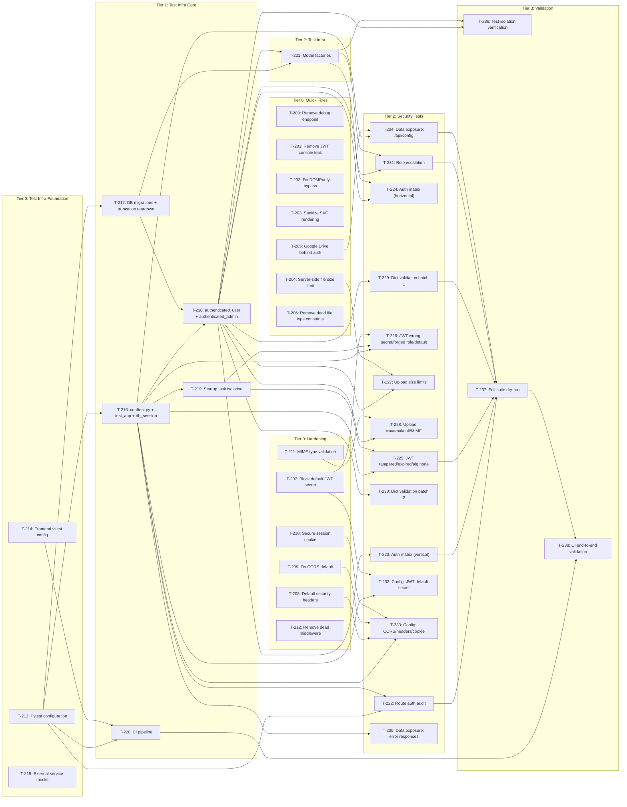

# Build Site: self.UI Security Fixes, Hardening, and Test Suite

Generated: 2026-04-11

Task IDs: T-200 through T-238 (39 tasks)
Source kits: cavekit-ui-security-quick-fixes.md, cavekit-ui-security-hardening.md, cavekit-ui-test-infrastructure.md, cavekit-ui-security-tests.md

---

## Tier 0 -- No Dependencies

All quick-fix and hardening tasks are pure code changes with no cross-dependencies. Test infrastructure foundation tasks (pytest config, frontend config) are also standalone. These can all execute in parallel.

### Quick Fixes (7 tasks)

| Task | Title | Cavekit | Requirement | blockedBy | Effort |
|------|-------|---------|-------------|-----------|--------|
| T-200 | Remove unauthenticated debug endpoint GET /api/v1/memories/ef | cavekit-ui-security-quick-fixes.md | R1 | -- | S |
| T-201 | Remove JWT token leak from login console.log | cavekit-ui-security-quick-fixes.md | R2 | -- | S |
| T-202 | Fix DOMPurify bypass in markdown rendering (block and inline iframe paths) | cavekit-ui-security-quick-fixes.md | R3 | -- | S |
| T-203 | Sanitize SVG content before rendering in SVG pan/zoom component | cavekit-ui-security-quick-fixes.md | R4 | -- | S |
| T-204 | Enforce server-side file size limit on upload endpoint | cavekit-ui-security-quick-fixes.md | R5 | -- | M |
| T-205 | Move Google Drive credentials behind authentication in /api/config | cavekit-ui-security-quick-fixes.md | R6 | -- | S |
| T-206 | Remove or wire in dead file type constants (SUPPORTED_FILE_TYPE, SUPPORTED_FILE_EXTENSIONS) | cavekit-ui-security-quick-fixes.md | R7 | -- | S |

### Hardening (6 tasks)

| Task | Title | Cavekit | Requirement | blockedBy | Effort |
|------|-------|---------|-------------|-----------|--------|
| T-207 | Block well-known default JWT secret on startup when auth is enabled | cavekit-ui-security-hardening.md | R1 | -- | M |
| T-208 | Set default security headers (X-Content-Type-Options, X-Frame-Options, Referrer-Policy) with env var override | cavekit-ui-security-hardening.md | R2 | -- | M |
| T-209 | Fix CORS default: disallow wildcard with credentials, log warning on explicit wildcard | cavekit-ui-security-hardening.md | R3 | -- | M |
| T-210 | Default session cookie Secure flag to true in non-debug mode, set SameSite | cavekit-ui-security-hardening.md | R4 | -- | M |
| T-211 | Add MIME type validation to file uploads with configurable allowlist and magic-byte checking | cavekit-ui-security-hardening.md | R5 | -- | M |
| T-212 | Remove dead commit_session_after_request middleware | cavekit-ui-security-hardening.md | R6 | -- | S |

### Test Infrastructure Foundation (3 tasks)

| Task | Title | Cavekit | Requirement | blockedBy | Effort |
|------|-------|---------|-------------|-----------|--------|
| T-213 | Create pytest configuration with testpaths, custom markers, strict mode, async backend, and timeout | cavekit-ui-test-infrastructure.md | R1 | -- | M |
| T-214 | Configure frontend vitest with Svelte plugin, DOM environment, aliases, and testing libraries | cavekit-ui-test-infrastructure.md | R5 | -- | M |
| T-215 | Create external service mock fixtures (Ollama, OpenAI, Llamolotl, Curator, eval harness) | cavekit-ui-test-infrastructure.md | R4 | -- | M |

## Tier 1 -- Depends on Tier 0

Test infrastructure tasks that depend on the pytest config or that are core fixtures needed by everything downstream.

### Test Infrastructure Core (5 tasks)

| Task | Title | Cavekit | Requirement | blockedBy | Effort |
|------|-------|---------|-------------|-----------|--------|
| T-216 | Create root conftest.py with test_app fixture (TestClient + dependency_overrides) and db_session fixture | cavekit-ui-test-infrastructure.md | R2 | T-213 | M |
| T-217 | Add database setup (Peewee + Alembic migrations) and truncation-based teardown to conftest.py | cavekit-ui-test-infrastructure.md | R2 | T-213 | L |
| T-218 | Add authenticated_user and authenticated_admin fixtures to conftest.py | cavekit-ui-test-infrastructure.md | R2 | T-216, T-217 | M |
| T-219 | Implement startup task isolation fixture (prevent 4 fire-and-forget tasks during tests) | cavekit-ui-test-infrastructure.md | R7 | T-216 | M |
| T-220 | Create CI pipeline: activate backend pytest job, add frontend vitest job, configure JUnit output | cavekit-ui-test-infrastructure.md | R6 | T-213, T-214 | M |

## Tier 2 -- Depends on Tier 0 + Tier 1

Model factories, remaining infra validation, and security tests that depend on both the fixes and the infrastructure.

### Test Infrastructure (1 task)

| Task | Title | Cavekit | Requirement | blockedBy | Effort |
|------|-------|---------|-------------|-----------|--------|
| T-221 | Create model factories (User, Auth, Chat, File, Knowledge, Tool, Function, TrainingJob, EvalJob, CuratorJob, JobWindow) | cavekit-ui-test-infrastructure.md | R3 | T-217, T-218 | M |

### Security Tests (17 tasks)

| Task | Title | Cavekit | Requirement | blockedBy | Effort |
|------|-------|---------|-------------|-----------|--------|
| T-222 | Route auth coverage audit: enumerate all routes and assert auth dependency except public allowlist | cavekit-ui-security-tests.md | R1 | T-213, T-216 | M |
| T-223 | Authorization matrix: parametrized test across all 32+ routers with anonymous, user, admin roles | cavekit-ui-security-tests.md | R2 | T-218 | L |
| T-224 | Authorization matrix: horizontal isolation test (user A cannot access user B resources) | cavekit-ui-security-tests.md | R2 | T-218, T-221 | M |
| T-225 | JWT security: tampered signature, expired token, alg:none attack | cavekit-ui-security-tests.md | R3 | T-216, T-219 | M |
| T-226 | JWT security: wrong secret, forged admin role claim, default secret rejection | cavekit-ui-security-tests.md | R3 | T-216, T-219, T-207 | M |
| T-227 | File upload security: size limit boundary tests (over-limit 413, at-limit success) | cavekit-ui-security-tests.md | R4 | T-218, T-204 | M |
| T-228 | File upload security: path traversal, null bytes, MIME mismatch | cavekit-ui-security-tests.md | R4 | T-218, T-211 | M |
| T-229 | Input validation on dict endpoints: missing fields, extra fields, type coercion (5 endpoints) | cavekit-ui-security-tests.md | R5 | T-218 | M |
| T-230 | Input validation on dict endpoints: deep nesting and remaining 5+ endpoints | cavekit-ui-security-tests.md | R5 | T-218 | M |
| T-231 | Role escalation prevention: parametrized test across all role-accepting endpoints | cavekit-ui-security-tests.md | R6 | T-218, T-221 | M |
| T-232 | Configuration security: JWT default secret startup failure test | cavekit-ui-security-tests.md | R7 | T-216, T-207 | M |
| T-233 | Configuration security: CORS policy, security headers, cookie Secure flag tests | cavekit-ui-security-tests.md | R7 | T-216, T-208, T-209, T-210 | M |
| T-234 | Sensitive data exposure: unauthenticated /api/config leaks no secrets or Google Drive keys | cavekit-ui-security-tests.md | R8 | T-216, T-205 | M |
| T-235 | Sensitive data exposure: error responses leak no stack traces, 401/403 leak no auth mechanism hints | cavekit-ui-security-tests.md | R8 | T-216 | M |

## Tier 3 -- Full Suite Validation (Depends on Tier 2)

| Task | Title | Cavekit | Requirement | blockedBy | Effort |
|------|-------|---------|-------------|-----------|--------|
| T-236 | Verify test isolation: two sequential tests writing same table observe no cross-contamination | cavekit-ui-test-infrastructure.md | R2 | T-218, T-221 | S |
| T-237 | Full suite dry-run: pytest --collect-only discovers all tests, markers resolve, no warnings | cavekit-ui-test-infrastructure.md | R1, R2 | T-222, T-223, T-225, T-229, T-231, T-234 | S |
| T-238 | CI end-to-end validation: backend tier0+tier1 tests pass, frontend smoke test passes | cavekit-ui-test-infrastructure.md | R6 | T-220, T-237 | S |

---

## Summary

| Metric | Count |
|--------|-------|
| Total tasks | 39 |
| Tier 0 (Quick Fixes) | 7 |
| Tier 0 (Hardening) | 6 |
| Tier 0 (Test Infra Foundation) | 3 |
| Tier 1 (Test Infra Core) | 5 |
| Tier 2 (Test Infra Factories) | 1 |
| Tier 2 (Security Tests) | 14 |
| Tier 3 (Validation) | 3 |
| Small (S) | 9 |
| Medium (M) | 27 |
| Large (L) | 3 |
| cavekit-ui-security-quick-fixes.md tasks | 7 |
| cavekit-ui-security-hardening.md tasks | 6 |
| cavekit-ui-test-infrastructure.md tasks | 12 |
| cavekit-ui-security-tests.md tasks | 14 |
| Total acceptance criteria | 152 |
| AC coverage | 152/152 (100%) |

---

## Coverage Matrix

Every acceptance criterion from all 28 requirements mapped to its task(s). 152 AC total, 152 covered.

### cavekit-ui-security-quick-fixes.md (25 AC)

#### R1: Remove Unauthenticated Debug Endpoint (3 AC)

| # | Acceptance Criterion | Task(s) |
|---|---------------------|---------|
| 1 | The route handler for GET /api/v1/memories/ef no longer exists in the codebase | T-200 |
| 2 | Requests to GET /api/v1/memories/ef return 404 or 405 | T-200 |
| 3 | All other /api/v1/memories/ endpoints continue to function with their existing authentication | T-200 |

#### R2: Remove JWT Leak from Console (2 AC)

| # | Acceptance Criterion | Task(s) |
|---|---------------------|---------|
| 1 | The auth page does not call console.log with an object containing a JWT token after login | T-201 |
| 2 | Login functionality is not affected (user is still authenticated and redirected correctly after login) | T-201 |

#### R3: Fix DOMPurify Bypass in Markdown Rendering (4 AC)

| # | Acceptance Criterion | Task(s) |
|---|---------------------|---------|
| 1 | Markdown token text containing iframe is sanitized through DOMPurify before rendering | T-202 |
| 2 | Markdown inline token text containing iframe is sanitized through DOMPurify before rendering | T-202 |
| 3 | Legitimate iframe embeds that DOMPurify allows (if any configured) still render correctly | T-202 |
| 4 | Non-iframe markdown content continues to render as before | T-202 |

#### R4: Sanitize SVG Rendering (3 AC)

| # | Acceptance Criterion | Task(s) |
|---|---------------------|---------|
| 1 | SVG content is passed through DOMPurify sanitization before being rendered as HTML | T-203 |
| 2 | DOMPurify is configured to permit SVG elements and attributes (not strip valid SVG) | T-203 |
| 3 | Valid SVG content continues to render and remain interactive (pan/zoom functionality preserved) | T-203 |

#### R5: Enforce Server-Side File Size Limit (5 AC)

| # | Acceptance Criterion | Task(s) |
|---|---------------------|---------|
| 1 | The upload endpoint rejects files exceeding the configured maximum size with HTTP 413 status | T-204 |
| 2 | The rejection occurs before the file is written to persistent storage | T-204 |
| 3 | The configured maximum size value is read from the same configuration source used by the frontend | T-204 |
| 4 | Files at or below the size limit are accepted as before | T-204 |
| 5 | The error response includes a message indicating the size limit was exceeded | T-204 |

#### R6: Move Google Drive Credentials Behind Auth (4 AC)

| # | Acceptance Criterion | Task(s) |
|---|---------------------|---------|
| 1 | Unauthenticated requests to /api/config do not include google_drive.client_id in the response | T-205 |
| 2 | Unauthenticated requests to /api/config do not include google_drive.api_key in the response | T-205 |
| 3 | Authenticated requests to /api/config continue to receive both values | T-205 |
| 4 | Frontend Google Drive functionality continues to work for logged-in users | T-205 |

#### R7: Remove Dead File Type Constants (4 AC)

| # | Acceptance Criterion | Task(s) |
|---|---------------------|---------|
| 1 | SUPPORTED_FILE_TYPE is either removed from the codebase or imported by at least one module | T-206 |
| 2 | SUPPORTED_FILE_EXTENSIONS is either removed from the codebase or imported by at least one module | T-206 |
| 3 | If removed: no remaining references exist in the codebase | T-206 |
| 4 | If wired in: the client-side upload flow uses the constants to validate file type before upload | T-206 |

### cavekit-ui-security-hardening.md (31 AC)

#### R1: Block Default JWT Secret on Startup (5 AC)

| # | Acceptance Criterion | Task(s) |
|---|---------------------|---------|
| 1 | Application startup fails with a clear error when the JWT secret matches the well-known default and authentication is enabled | T-207 |
| 2 | The error message identifies the problem (insecure default secret) and the remediation (set a unique secret) | T-207 |
| 3 | Application startup succeeds when a non-default, non-empty secret is configured | T-207 |
| 4 | Application startup succeeds with the default secret when authentication is explicitly disabled | T-207 |
| 5 | The behavior is testable: a test can verify the startup failure by configuring the known-default secret with auth enabled | T-207, T-232 |

#### R2: Set Default Security Headers (6 AC)

| # | Acceptance Criterion | Task(s) |
|---|---------------------|---------|
| 1 | Responses include X-Content-Type-Options: nosniff by default (no configuration required) | T-208 |
| 2 | Responses include X-Frame-Options: DENY by default | T-208 |
| 3 | Responses include Referrer-Policy: strict-origin-when-cross-origin by default | T-208 |
| 4 | Each default header can be overridden via its corresponding environment variable | T-208 |
| 5 | Explicitly configured headers replace (not duplicate) the defaults | T-208 |
| 6 | Static file responses and API responses both include the default headers | T-208 |

#### R3: Fix CORS Default (5 AC)

| # | Acceptance Criterion | Task(s) |
|---|---------------------|---------|
| 1 | The default CORS origin is not wildcard (*) when credentials are allowed | T-209 |
| 2 | When wildcard origin is explicitly configured via environment variable, a warning is logged at startup | T-209 |
| 3 | The warning message identifies the security risk (wildcard + credentials) | T-209 |
| 4 | CORS behavior is correct for non-wildcard configured origins (preflight and actual requests succeed for allowed, fail for others) | T-209 |
| 5 | Existing deployments that explicitly set a non-wildcard origin are unaffected | T-209 |

#### R4: Secure Session Cookie by Default (5 AC)

| # | Acceptance Criterion | Task(s) |
|---|---------------------|---------|
| 1 | The session cookie secure flag defaults to true when the application is not in debug mode | T-210 |
| 2 | The session cookie secure flag defaults to false when the application is in debug mode | T-210 |
| 3 | An explicit environment variable can override the secure flag to false regardless of mode | T-210 |
| 4 | An explicit environment variable can override the secure flag to true regardless of mode | T-210 |
| 5 | The SameSite attribute on the session cookie is set to Lax or Strict (not None without Secure) | T-210 |

#### R5: Add MIME Type Validation to File Uploads (6 AC)

| # | Acceptance Criterion | Task(s) |
|---|---------------------|---------|
| 1 | The upload endpoint rejects files with MIME types not in the allowlist, returning HTTP 415 status | T-211 |
| 2 | The default allowlist includes at minimum: text/plain, text/csv, application/json, application/pdf, image/png, image/jpeg, audio/mpeg, audio/wav | T-211 |
| 3 | The allowlist is configurable via environment variable or application configuration | T-211 |
| 4 | The MIME type check uses the file content (magic bytes), not solely the declared Content-Type header | T-211 |
| 5 | Files matching the allowlist continue to upload successfully | T-211 |
| 6 | The error response includes the rejected MIME type and a reference to the allowlist | T-211 |

#### R6: Remove Dead Middleware (4 AC)

| # | Acceptance Criterion | Task(s) |
|---|---------------------|---------|
| 1 | The commit_session_after_request middleware function no longer exists in the codebase | T-212 |
| 2 | The middleware is no longer registered in the application startup | T-212 |
| 3 | No remaining code references the removed middleware function | T-212 |
| 4 | Application request handling is otherwise unchanged (existing endpoints return the same responses) | T-212 |

### cavekit-ui-test-infrastructure.md (48 AC)

#### R1: Pytest Configuration (8 AC)

| # | Acceptance Criterion | Task(s) |
|---|---------------------|---------|
| 1 | pytest configuration exists (in pyproject.toml or equivalent) with testpaths pointing to the backend test directory | T-213 |
| 2 | Custom markers are registered: tier0, tier1, tier2, security, slow, gpu | T-213 |
| 3 | Strict marker mode is enabled (unregistered markers cause errors) | T-213 |
| 4 | Async test backend is configured for anyio (not pytest-asyncio) | T-213 |
| 5 | A default test timeout is set (between 30 and 120 seconds) | T-213 |
| 6 | Running pytest --collect-only from the backend directory discovers tests without warnings about unknown markers | T-213, T-237 |
| 7 | Running pytest -m tier0 collects only tier0-marked tests | T-213, T-237 |
| 8 | Running pytest -m security collects only security-marked tests | T-213, T-237 |

#### R2: Backend Test Fixtures -- Truncation-Based (10 AC)

| # | Acceptance Criterion | Task(s) |
|---|---------------------|---------|
| 1 | A root-level conftest.py provides fixtures available to all backend test sub-packages | T-216 |
| 2 | A test_app fixture provides an HTTP test client connected to the FastAPI application without starting a real server | T-216 |
| 3 | Database dependencies are overridden via app.dependency_overrides, not by patching module-level imports | T-216 |
| 4 | Both Peewee and Alembic migrations run during test session setup, producing a complete schema | T-217 |
| 5 | After each test function, all user-created data is removed via truncation (DELETE) in foreign-key-safe order | T-217 |
| 6 | An authenticated_user fixture provides a test client pre-configured with a valid user-role session token | T-218 |
| 7 | An authenticated_admin fixture provides a test client pre-configured with a valid admin-role session token | T-218 |
| 8 | A db_session fixture provides direct database session access for tests that need to arrange data or assert DB state | T-216 |
| 9 | Two tests that write to the same table and run sequentially do not observe each other's data | T-236 |
| 10 | Fixtures do not rely on metadata.create_all() as the sole schema source (Peewee-only columns must be present) | T-217 |

#### R3: Model Factories (6 AC)

| # | Acceptance Criterion | Task(s) |
|---|---------------------|---------|
| 1 | Factories exist for: User, Auth, Chat, File, Knowledge, Tool, Function, TrainingJob, EvalJob, CuratorJob, JobWindow | T-221 |
| 2 | Each factory produces a valid, persistable instance when called with no arguments | T-221 |
| 3 | Factory-generated instances have unique identifiers (no collisions across multiple calls) | T-221 |
| 4 | Factories support overriding any field via keyword arguments | T-221 |
| 5 | Factories are importable from a single module (not scattered across test files) | T-221 |
| 6 | The existing _make_*() helper functions in current test files can be replaced by factory calls without changing test semantics | T-221 |

#### R4: External Service Mocking (6 AC)

| # | Acceptance Criterion | Task(s) |
|---|---------------------|---------|
| 1 | A mock fixture exists for each external service: Ollama, OpenAI, Llamolotl, Curator, eval harness | T-215 |
| 2 | Each mock intercepts outbound HTTP requests to the service's configured base URL | T-215 |
| 3 | Each mock supports configurable response scenarios: success, error (4xx/5xx), and timeout | T-215 |
| 4 | Mocks for streaming endpoints return well-formed streaming responses (SSE or chunked) | T-215 |
| 5 | Tests using these mocks make zero real network requests (verified by the mock asserting no unmatched requests leak through) | T-215 |
| 6 | Mocks are composable: a single test can activate mocks for multiple services simultaneously | T-215 |

#### R5: Frontend Test Configuration (6 AC)

| # | Acceptance Criterion | Task(s) |
|---|---------------------|---------|
| 1 | A vitest configuration file exists with the Svelte plugin and a DOM environment (jsdom or equivalent) | T-214 |
| 2 | Module aliases for $app/*, $lib/*, and other SvelteKit path aliases resolve correctly in tests | T-214 |
| 3 | A setup file provides DOM testing matchers (e.g., custom matchers for DOM assertions) | T-214 |
| 4 | @testing-library/svelte (v4+), @testing-library/jest-dom, and a network-level request mocking library are listed as dev dependencies | T-214 |
| 5 | Running the frontend test command discovers and runs test files under the src/ directory | T-214 |
| 6 | A sample smoke test (e.g., rendering a simple component) passes, confirming the toolchain works end-to-end | T-214 |

#### R6: CI Pipeline (7 AC)

| # | Acceptance Criterion | Task(s) |
|---|---------------------|---------|
| 1 | The backend pytest job in the CI workflow is uncommented and functional | T-220 |
| 2 | The backend job runs tier0 and tier1 marked tests on every pull request | T-220 |
| 3 | A frontend test job exists in the CI workflow and runs vitest on every pull request | T-220 |
| 4 | Both jobs fail the overall CI check if any test fails | T-220 |
| 5 | The backend job produces test result output consumable by the CI platform (JUnit XML or equivalent) | T-220 |
| 6 | The frontend job produces test result output consumable by the CI platform | T-220 |
| 7 | Both jobs run in the existing CI environment without requiring additional infrastructure | T-220, T-238 |

#### R7: Startup Task Isolation (5 AC)

| # | Acceptance Criterion | Task(s) |
|---|---------------------|---------|
| 1 | A fixture or test configuration mechanism prevents all four startup tasks from executing during test runs | T-219 |
| 2 | The prevention mechanism does not require modifying production code paths (uses overrides, mocking, or lifespan control) | T-219 |
| 3 | Tests that specifically need to test a startup task's behavior can opt in to running that task in isolation | T-219 |
| 4 | No warnings or errors are logged about cancelled tasks during normal test execution | T-219 |
| 5 | Database state is not modified by background tasks after test teardown completes | T-219 |

### cavekit-ui-security-tests.md (48 AC)

#### R1: Route Auth Coverage Audit (6 AC)

| # | Acceptance Criterion | Task(s) |
|---|---------------------|---------|
| 1 | A test enumerates all registered routes from the application's router table | T-222 |
| 2 | The test asserts that every route not in the public allowlist has an auth dependency in its dependency chain | T-222 |
| 3 | The public allowlist includes exactly: /health, /health/db, /api/version, /api/changelog, /api/config, /docs, /openapi.json, and OAuth callback routes | T-222 |
| 4 | Adding a new route without an auth dependency causes the test to fail (verified by the test's design, not by actually adding a route) | T-222 |
| 5 | The test output identifies which specific routes are missing auth when it fails | T-222 |
| 6 | The test does not make HTTP requests -- it inspects the route definitions programmatically | T-222 |

#### R2: Authorization Matrix (8 AC)

| # | Acceptance Criterion | Task(s) |
|---|---------------------|---------|
| 1 | The test is parametrized across all routers (32+) and three roles: anonymous, user, admin | T-223 |
| 2 | Anonymous requests to authenticated endpoints receive 401 or 403 | T-223 |
| 3 | User-role requests to admin-only endpoints receive 403 | T-223 |
| 4 | Admin-role requests to admin endpoints receive 200 (or appropriate success status) | T-223 |
| 5 | User-role requests to user-accessible endpoints succeed (200 or appropriate success status) | T-223 |
| 6 | At least one horizontal isolation test exists: user A cannot read or modify user B's resources (chats, files, or memories) | T-224 |
| 7 | The test matrix is defined declaratively (data-driven), not as individual test functions per endpoint | T-223 |
| 8 | Test failures identify the specific (role, endpoint, expected_status, actual_status) tuple | T-223 |

#### R3: JWT Security (7 AC)

| # | Acceptance Criterion | Task(s) |
|---|---------------------|---------|
| 1 | A request with a tampered JWT signature receives 401 | T-225 |
| 2 | A request with an expired JWT receives 401 | T-225 |
| 3 | A request with a JWT using alg: none receives 401 | T-225 |
| 4 | A request with a JWT signed with a wrong/random secret receives 401 | T-226 |
| 5 | A request with a JWT containing a forged admin role claim is rejected (role is read from the database, not the token) | T-226 |
| 6 | A request with a JWT signed using the well-known default secret (t0p-s3cr3t) is rejected when the application is configured with a different secret | T-226 |
| 7 | Each test case is independent and produces a clear failure message identifying the attack vector tested | T-225, T-226 |

#### R4: File Upload Security (6 AC)

| # | Acceptance Criterion | Task(s) |
|---|---------------------|---------|
| 1 | Uploading a file exceeding the configured size limit returns HTTP 413 | T-227 |
| 2 | Uploading a file at exactly the size limit succeeds (boundary test) | T-227 |
| 3 | A filename containing path traversal sequences (../, ..\\) is rejected or sanitized (file is not written outside the upload directory) | T-228 |
| 4 | A filename containing null bytes is rejected or sanitized | T-228 |
| 5 | A file with mismatched MIME type (content does not match declared type) is rejected with HTTP 415 | T-228 |
| 6 | Each test produces a clear failure message identifying the attack vector tested | T-227, T-228 |

#### R5: Input Validation on Dict Endpoints (6 AC)

| # | Acceptance Criterion | Task(s) |
|---|---------------------|---------|
| 1 | Sending a request with missing required fields returns an appropriate error (400 or 422), not a 500 | T-229 |
| 2 | Sending a request with extra/unexpected fields does not cause a server error (returns success or ignores the extra fields) | T-229 |
| 3 | Sending a request with type coercion attacks (string where integer expected, array where string expected) returns an appropriate error, not a 500 | T-229 |
| 4 | Sending a deeply nested object (100+ levels) does not cause a stack overflow or excessive processing time (returns 400 or is truncated) | T-230 |
| 5 | At least 10 of the 19+ dict-accepting endpoints are covered | T-229, T-230 |
| 6 | Each test case documents which endpoint it targets and what validation gap it exercises | T-229, T-230 |

#### R6: Role Escalation Prevention (5 AC)

| # | Acceptance Criterion | Task(s) |
|---|---------------------|---------|
| 1 | A user-role caller submitting a profile update with role: admin does not become an admin | T-231 |
| 2 | A user-role caller submitting settings with role: admin does not become an admin | T-231 |
| 3 | The test is parametrized across all endpoints that accept a request body containing a role field | T-231 |
| 4 | After each escalation attempt, the test verifies the user's role in the database is unchanged | T-231 |
| 5 | The endpoint either ignores the role field or returns an error -- either outcome is acceptable as long as the role is not changed | T-231 |

#### R7: Configuration Security (5 AC)

| # | Acceptance Criterion | Task(s) |
|---|---------------------|---------|
| 1 | A test verifies that application startup fails when the JWT secret is the well-known default and auth is enabled | T-232 |
| 2 | A test verifies that CORS does not allow wildcard origin when credentials are enabled (the default configuration) | T-233 |
| 3 | A test verifies that responses include X-Content-Type-Options, X-Frame-Options, and Referrer-Policy headers with the expected default values | T-233 |
| 4 | A test verifies that the session cookie has the Secure flag set when the application is not in debug mode | T-233 |
| 5 | Each test can run independently without relying on other configuration tests | T-232, T-233 |

#### R8: Sensitive Data Exposure (5 AC)

| # | Acceptance Criterion | Task(s) |
|---|---------------------|---------|
| 1 | Unauthenticated GET /api/config does not include API keys, JWT secrets, or database connection strings in the response body | T-234 |
| 2 | Unauthenticated GET /api/config does not include Google Drive client_id or api_key in the response body | T-234 |
| 3 | Error responses (triggering a 500 via malformed input) do not contain Python stack traces or internal file paths | T-235 |
| 4 | The response body of 401/403 errors does not include information about what auth mechanism is expected (no hints for attackers) | T-235 |
| 5 | Each test documents what sensitive data it checks for and where the exposure was identified | T-234, T-235 |

---

## Dependency Graph

---

## Architect Report

### Build Shape

39 tasks across 4 tiers. The build is wide at Tier 0 (16 independent tasks across 3 workstreams) and stays wide through Tier 2 (15 tasks). This reflects the architecture of the kits: quick fixes, hardening, and test infrastructure are all independent workstreams that converge only at the security tests layer.

| Tier | Tasks | Workstreams |
|------|-------|-------------|
| 0 | 16 | Quick Fixes (7), Hardening (6), Test Infra Foundation (3) |
| 1 | 5 | Test Infra Core |
| 2 | 15 | Factories (1), Security Tests (14) |
| 3 | 3 | Validation |

### Critical Path

The longest dependency chain:

**T-213 (pytest config) -> T-217 (DB setup) -> T-218 (auth fixtures) -> T-221 (factories) -> T-224 (horizontal isolation test) -> T-237 (dry-run) -> T-238 (CI validation)**

This is 7 steps deep. The infrastructure chain (T-213 through T-218) is the bottleneck -- once auth fixtures land, 12 of 14 security test tasks unblock. The factory task (T-221) only gates 2 tests (T-224 horizontal isolation, T-231 role escalation).

### Parallelism Opportunities

**Tier 0 (16 tasks, 3 independent workstreams):**
All quick fixes, all hardening changes, and test infrastructure foundation are mutually independent. A 3-agent parallel execution can assign one agent per workstream. Within each workstream, tasks are also independent of each other.

**Tier 1 (5 tasks, limited parallelism):**
T-216 and T-217 both depend only on T-213 and can run in parallel. T-218 gates on both. T-219 gates only on T-216. T-220 gates on T-213 + T-214.

**Tier 2 (15 tasks, high parallelism):**
After T-218 (auth fixtures) lands, 10 security test tasks unblock simultaneously. After T-221 (factories) lands, 2 more unblock. After T-219 (startup isolation) lands, 2 JWT test tasks unblock. Most of these are independent of each other.

Optimal execution with 4 agents:
1. Agent A: Quick fixes (T-200 through T-206)
2. Agent B: Hardening (T-207 through T-212)
3. Agent C: Test infrastructure (T-213 through T-221)
4. Agent D: Frontend test config (T-214) then CI pipeline (T-220), then security tests

Wall-clock compression: ~35 hours sequential reduces to ~10-12 hours with 4 agents.

### Frontend Tasks

Three tasks touch Svelte/TypeScript files in self.UI/src:
- **T-201** (JWT console.log removal) -- Svelte auth page
- **T-202** (DOMPurify bypass) -- Svelte markdown components
- **T-203** (SVG sanitization) -- Svelte SVG component

Per CLAUDE.md, these files use tab indentation and must be edited via Python-based replacement (not the Edit tool). The build site flags these as Tier 0 / Small effort because each is a surgical 1-3 line change, but the editing method constraint must be respected.

**T-214** (frontend vitest config) runs inside Docker since Node.js is not installed on the host.

### Cross-Kit Dependencies in Security Tests

Several security test tasks depend on BOTH a test infrastructure task AND a fix/hardening task:

| Security Test | Infra Dependency | Fix/Hardening Dependency |
|---------------|-----------------|--------------------------|
| T-226 (JWT default secret test) | T-216, T-219 | T-207 (block default secret) |
| T-227 (upload size boundary) | T-218 | T-204 (server-side size limit) |
| T-228 (upload traversal/MIME) | T-218 | T-211 (MIME validation) |
| T-232 (config: JWT secret) | T-216 | T-207 (block default secret) |
| T-233 (config: CORS/headers/cookie) | T-216 | T-208, T-209, T-210 |
| T-234 (data exposure: /api/config) | T-216 | T-205 (Google Drive behind auth) |

These cross-kit edges mean that security tests cannot begin until both their infrastructure AND the feature they validate are complete. The Mermaid graph captures all these edges. Agents working on security tests should verify the relevant fix is already merged before writing the test.

### Risk Areas

1. **T-217 (DB migrations + truncation teardown)** is the most complex infrastructure task. The dual Peewee + SQLAlchemy architecture means transaction rollback is unworkable; truncation must follow foreign-key-safe ordering. This is the only L-sized infrastructure task and the most likely to exceed its budget.

2. **T-223 (authorization matrix)** is L-sized and parametrized across 32+ routers. The declarative matrix must handle varying HTTP methods, required path params, and request bodies. Some endpoints may require specific data setup. Budget 3+ hours.

3. **T-211 (MIME type validation)** requires magic-byte detection (python-magic or equivalent). If python-magic is not already a dependency, it must be added. Verify the library is available in the container environment.

4. **T-207 (block default JWT secret)** changes startup behavior. Must be tested carefully to avoid breaking existing deployments. The guard must check `WEBUI_AUTH` state to avoid blocking the auth-disabled case.

5. **T-214 (frontend vitest config)** runs in Docker. The existing vitest config passes with no tests and no testing libraries. Adding @testing-library/svelte requires npm install inside the container, which may affect the Docker build.

### Effort Distribution

| Size | Count | Estimated Hours |
|------|-------|-----------------|
| Small (S) | 9 | ~4.5 |
| Medium (M) | 27 | ~27 |
| Large (L) | 3 | ~9 |
| **Total** | **39** | **~40.5** |

### Recommended Execution Order

1. **Immediate (Tier 0, all parallel):** T-200-T-206 (quick fixes), T-207-T-212 (hardening), T-213-T-215 (infra foundation)
2. **Next (Tier 1, as dependencies resolve):** T-216+T-217 in parallel (both need only T-213), then T-218 (needs both), T-219 (needs T-216), T-220 (needs T-213+T-214)
3. **Main build (Tier 2):** T-221 (factories) first, then all security tests in parallel. Prioritize cross-kit tests (T-226, T-227, T-228, T-232, T-233, T-234) as they validate the Tier 0 fixes.
4. **Validation (Tier 3):** T-236 (isolation check), T-237 (dry-run), T-238 (CI end-to-end)
