# Build Site: self.llamolotl

Generated: 2026-04-11

## Tier 0 — No Dependencies

| Task | Title | Cavekit | Requirement | blockedBy | Effort |
|------|-------|---------|-------------|-----------|--------|
| T-001 | Delete heretic_run.py and remove heretic endpoints | cavekit-llamolotl-platform.md | R1 | — | M |
| T-002 | Remove heretic Pydantic models, optuna dep, and verify clean build | cavekit-llamolotl-platform.md | R1 | — | M |
| T-003 | Standardize logging in main.py (replace print with logging) | cavekit-llamolotl-platform.md | R2 | — | M |
| T-004 | Standardize logging in bake_model.py and remaining modules | cavekit-llamolotl-platform.md | R2 | — | M |
| T-005 | Configure log format (timestamp, level, module) and consistent logger naming | cavekit-llamolotl-platform.md | R2 | — | S |
| T-006 | Implement composite health endpoint (GET /health) | cavekit-llamolotl-platform.md | R4 | — | M |
| T-007 | Add GPU availability and disk space to health response | cavekit-llamolotl-platform.md | R4 | — | S |
| T-008 | Separate liveness vs readiness probes, degraded inference handling | cavekit-llamolotl-platform.md | R4 | — | M |
| T-009 | Implement training job state machine (PENDING/APPROVED/RUNNING/COMPLETED/FAILED) | cavekit-llamolotl-training.md | R1 | — | L |
| T-010 | Implement config CRUD and clone endpoints | cavekit-llamolotl-training.md | R2 | — | M |
| T-011 | Implement config merge (job overrides) and field aliasing | cavekit-llamolotl-training.md | R2 | — | M |
| T-012 | Implement config validation with clear error messages | cavekit-llamolotl-training.md | R2 | — | S |
| T-013 | Implement single and multi-adapter LoRA merge | cavekit-llamolotl-pipeline.md | R1 | — | L |
| T-014 | Add merge validation, error handling, and output dir management | cavekit-llamolotl-pipeline.md | R1 | — | M |
| T-015 | Implement HF to GGUF conversion with output type selection | cavekit-llamolotl-pipeline.md | R2 | — | M |
| T-016 | Add HF-to-GGUF input validation, progress reporting, and cleanup | cavekit-llamolotl-pipeline.md | R2 | — | M |
| T-017 | Implement LoRA to GGUF conversion with auto-detection | cavekit-llamolotl-pipeline.md | R3 | — | M |
| T-018 | Ensure LoRA-to-GGUF runs in background with task tracking | cavekit-llamolotl-pipeline.md | R3 | — | S |
| T-019 | Implement quantization with all standard quant types | cavekit-llamolotl-pipeline.md | R4 | — | M |
| T-020 | Add quantization input validation, progress, naming, and cleanup | cavekit-llamolotl-pipeline.md | R4 | — | M |
| T-021 | Implement pipeline task lifecycle (create, track, query, SSE logs) | cavekit-llamolotl-pipeline.md | R6 | — | L |
| T-022 | Implement pipeline/training mutual exclusion and auto-start on training complete | cavekit-llamolotl-pipeline.md | R6 | — | M |
| T-023 | Implement llama-server supervisord lifecycle (start, restart, wrapper script) | cavekit-llamolotl-inference.md | R1 | — | M |
| T-024 | Detect and report llama-server startup failure via health | cavekit-llamolotl-inference.md | R1 | — | S |
| T-025 | Implement model listing (local GGUF with metadata) | cavekit-llamolotl-inference.md | R2 | — | M |
| T-026 | Implement model pull from HF Hub and metadata persistence | cavekit-llamolotl-inference.md | R2 | — | M |
| T-027 | Implement model deletion (file + metadata) | cavekit-llamolotl-inference.md | R2 | — | S |
| T-028 | Implement HF Hub available models listing | cavekit-llamolotl-inference.md | R2 | — | S |
| T-029 | Implement LoRA preload at startup (--lora-init-without-apply) | cavekit-llamolotl-inference.md | R3 | — | M |
| T-030 | Implement apply-loras and active-loras proxy endpoints | cavekit-llamolotl-inference.md | R3 | — | M |
| T-031 | Implement per-request LoRA in /v1/chat/completions | cavekit-llamolotl-inference.md | R3 | — | M |
| T-032 | Handle new adapter restart logic and auto-detect unconverted adapters | cavekit-llamolotl-inference.md | R3 | — | M |

## Tier 1 — Depends on Tier 0

| Task | Title | Cavekit | Requirement | blockedBy | Effort |
|------|-------|---------|-------------|-----------|--------|
| T-033 | Fix exception handling in DeepSpeed config parse and metrics refresh | cavekit-llamolotl-platform.md | R3 | T-003, T-004 | M |
| T-034 | Fix exception handling in output dir extraction and remaining bare except:pass sites | cavekit-llamolotl-platform.md | R3 | T-003, T-004 | M |
| T-035 | Implement dataset format handlers (chat_template, sharegpt, alpaca, completion) | cavekit-llamolotl-training.md | R3 | T-010 | L |
| T-036 | Implement multi-dataset concatenation and val_set_size split | cavekit-llamolotl-training.md | R3 | T-010 | M |
| T-037 | Implement unknown format fallback and dataset loading error handling | cavekit-llamolotl-training.md | R3 | T-010 | S |
| T-038 | Implement LoRA adapter setup (configurable r, alpha, dropout, target_modules) | cavekit-llamolotl-training.md | R4 | T-010 | M |
| T-039 | Implement QLoRA 4-bit and 8-bit quantization with ZeRO-3 guard | cavekit-llamolotl-training.md | R4 | T-010 | M |
| T-040 | Implement lora_target_linear option | cavekit-llamolotl-training.md | R4 | T-010 | S |
| T-041 | Implement DeepSpeed ZeRO-2 and ZeRO-3 loading with CPU offload | cavekit-llamolotl-training.md | R5 | T-010 | L |
| T-042 | Implement DeepSpeed optimizer conflict resolution and config error handling | cavekit-llamolotl-training.md | R5 | T-010 | M |
| T-043 | Implement checkpoint saving at configurable intervals with save_total_limit | cavekit-llamolotl-training.md | R6 | T-009 | M |
| T-044 | Implement checkpoint resume (auto-detect latest, explicit path, correct step) | cavekit-llamolotl-training.md | R6 | T-009 | M |
| T-045 | Implement metrics refresh from trainer_state.json and GET /api/jobs/{job_id} | cavekit-llamolotl-training.md | R7 | T-009 | M |
| T-046 | Implement live log streaming (SSE) and static log fetch | cavekit-llamolotl-training.md | R7 | T-009 | M |
| T-047 | Handle metrics refresh failure (log, don't swallow) | cavekit-llamolotl-training.md | R7 | T-009 | S |
| T-048 | Implement bake pipeline (merge -> convert -> quantize, single API call) | cavekit-llamolotl-pipeline.md | R5 | T-013, T-015, T-019 | L |
| T-049 | Add bake pipeline step progress, skip-quantize option, failure handling, intermediate artifacts | cavekit-llamolotl-pipeline.md | R5 | T-013, T-015, T-019 | M |
| T-050 | Remove hardcoded chat template, rely on GGUF auto-detection | cavekit-llamolotl-inference.md | R4 | T-023 | S |
| T-051 | Implement custom template upload, storage, and --chat-template-file passthrough | cavekit-llamolotl-inference.md | R4 | T-023 | M |
| T-052 | Implement template override clear and built-in named template fallback | cavekit-llamolotl-inference.md | R4 | T-023 | S |
| T-053 | Implement inference health endpoint (composite status, model, LoRAs, GPU memory) | cavekit-llamolotl-inference.md | R5 | T-029, T-030 | M |
| T-054 | Implement inference liveness vs readiness and degraded-state handling | cavekit-llamolotl-inference.md | R5 | T-029, T-030 | M |

## Tier 2 — Depends on Tier 0 and 1

| Task | Title | Cavekit | Requirement | blockedBy | Effort |
|------|-------|---------|-------------|-----------|--------|
| T-055 | Decompose main.py: extract jobs router | cavekit-llamolotl-platform.md | R6 | T-001, T-002 | M |
| T-056 | Decompose main.py: extract models and pipeline routers | cavekit-llamolotl-platform.md | R6 | T-001, T-002 | M |
| T-057 | Decompose main.py: extract system router and shared state module | cavekit-llamolotl-platform.md | R6 | T-001, T-002 | M |
| T-058 | Reduce main.py to app creation + router mounting, verify all paths preserved | cavekit-llamolotl-platform.md | R6 | T-055, T-056, T-057 | M |

## Tier 3 — Depends on Tier 0, 1, and 2

| Task | Title | Cavekit | Requirement | blockedBy | Effort |
|------|-------|---------|-------------|-----------|--------|
| T-059 | Set up pytest infrastructure (conftest.py, test directory, Docker runner) | cavekit-llamolotl-platform.md | R5 | T-055, T-056, T-057, T-058 | M |
| T-060 | Write tests: job state machine transitions | cavekit-llamolotl-platform.md | R5 | T-059 | M |
| T-061 | Write tests: config parsing, field aliasing, dataset formats | cavekit-llamolotl-platform.md | R5 | T-059 | M |
| T-062 | Write tests: pipeline task lifecycle | cavekit-llamolotl-platform.md | R5 | T-059 | M |

## Tier 4 — Post-Inspection Fixes (from /ck:check findings)

| Task | Title | Cavekit | Requirement | blockedBy | Effort | Finding |
|------|-------|---------|-------------|-----------|--------|---------|
| T-063 | Fix queued pipeline task command persistence (add fields to PipelineTask model) | cavekit-llamolotl-platform.md | R8 | T-058 | M | F-001 (P0) |
| T-064 | Close log file handles after subprocess.Popen | cavekit-llamolotl-platform.md | R8 | T-058 | S | F-002 (P1) |
| T-065 | Add path traversal validation to config GET/DELETE and job config_path | cavekit-llamolotl-platform.md | R7 | T-058 | M | F-003/F-009 (P1/P2) |
| T-066 | Add path traversal validation to pipeline merge-lora, quantize, convert-lora, convert-to-gguf | cavekit-llamolotl-platform.md | R7 | T-058 | M | F-004/F-018 (P1/P2) |
| T-067 | Sequential GPU pipeline task dispatch (one at a time, not all simultaneously) | cavekit-llamolotl-pipeline.md | R6 | T-022 | M | F-005 (P1) |
| T-068 | Terminate log streaming generators when job/task reaches terminal state | cavekit-llamolotl-platform.md | R8 | T-058 | S | F-010 (P2) |
| T-069 | Clean up partial pipeline output on failure (not just on cancel) | cavekit-llamolotl-platform.md | R8 | T-058 | S | F-002 (P2) |
| T-070 | Create Pydantic model for chat template upload (replace raw dict) | cavekit-llamolotl-inference.md | R4 | — | S | F-011 (P2) |
| T-071 | Use pynvml/nvidia-smi for system-wide GPU memory in health (not torch.cuda) | cavekit-llamolotl-platform.md | R4 | — | M | F-012 (P2) |

---

## Summary

| Metric | Count |
|--------|-------|
| Total tasks | 62 |
| Tier 0 | 32 |
| Tier 1 | 22 |
| Tier 2 | 4 |
| Tier 3 | 4 |
| Small (S) | 13 |
| Medium (M) | 40 |
| Large (L) | 9 |
| cavekit-llamolotl-platform.md tasks | 18 |
| cavekit-llamolotl-training.md tasks | 18 |
| cavekit-llamolotl-pipeline.md tasks | 14 |
| cavekit-llamolotl-inference.md tasks | 12 |
| Total acceptance criteria | 126 |
| AC coverage | 100% |

---

## Coverage Matrix

Every acceptance criterion mapped to its task(s). 126 AC total, 126 covered.

### cavekit-llamolotl-platform.md

| Requirement | Acceptance Criterion | Task(s) |
|-------------|---------------------|---------|
| R1: Heretic Removal | heretic_run.py deleted | T-001 |
| R1: Heretic Removal | All heretic-related endpoints removed from main.py | T-001 |
| R1: Heretic Removal | All heretic-related Pydantic models removed | T-002 |
| R1: Heretic Removal | optuna dependency removed if not used elsewhere | T-002 |
| R1: Heretic Removal | No remaining references to "heretic" or "abliteration" in codebase | T-002 |
| R1: Heretic Removal | Docker build still succeeds after removal | T-002 |
| R2: Logging | main.py uses logging module instead of print() | T-003 |
| R2: Logging | bake_model.py uses logging module instead of custom log() wrapper | T-004 |
| R2: Logging | All modules use consistent logger naming (module-level) | T-005 |
| R2: Logging | Log levels appropriate: INFO, WARNING, ERROR, DEBUG | T-005 |
| R2: Logging | Log format includes timestamp, level, module name | T-005 |
| R3: Exception Handling | DeepSpeed config parse catches specific exceptions | T-033 |
| R3: Exception Handling | Metrics refresh catches specific JSON errors, preserves last-known | T-033 |
| R3: Exception Handling | Output dir extraction catches YAML errors | T-034 |
| R3: Exception Handling | All 13 bare except:pass sites addressed | T-034 |
| R3: Exception Handling | No bare except:pass remains in api/ directory | T-034 |
| R4: Health | GET /health returns composite status object | T-006 |
| R4: Health | Probes llama-server at localhost:8080/health | T-006 |
| R4: Health | Reports GPU availability via torch.cuda.is_available() | T-007 |
| R4: Health | Reports disk space on /models and /workspace volumes | T-007 |
| R4: Health | Liveness vs readiness endpoints separated | T-008 |
| R4: Health | Health check failures on inference side report degraded, don't crash | T-008 |
| R5: Test Infrastructure | pytest configured with conftest.py and test directory | T-059 |
| R5: Test Infrastructure | Job state machine transitions tested | T-060 |
| R5: Test Infrastructure | Config parsing and field aliasing tested | T-061 |
| R5: Test Infrastructure | Dataset format detection tested | T-061 |
| R5: Test Infrastructure | Pipeline task lifecycle tested | T-062 |
| R5: Test Infrastructure | Tests runnable inside Docker container | T-059 |
| R6: main.py Decomposition | Job endpoints -> routers/jobs.py | T-055 |
| R6: main.py Decomposition | Model endpoints -> routers/models.py | T-056 |
| R6: main.py Decomposition | Pipeline endpoints -> routers/pipeline.py | T-056 |
| R6: main.py Decomposition | System endpoints -> routers/system.py | T-057 |
| R6: main.py Decomposition | Shared state -> state.py or similar | T-057 |
| R6: main.py Decomposition | main.py reduced to app creation + router mounting | T-058 |
| R6: main.py Decomposition | All endpoints maintain same paths and behavior | T-058 |
| R6: main.py Decomposition | No functionality change — pure structural refactor | T-058 |

### cavekit-llamolotl-training.md

| Requirement | Acceptance Criterion | Task(s) |
|-------------|---------------------|---------|
| R1: Job Lifecycle | Job created via POST /api/jobs enters PENDING state | T-009 |
| R1: Job Lifecycle | Job does not start until approved=True | T-009 |
| R1: Job Lifecycle | Only one job runs at a time; next approved starts on complete/fail | T-009 |
| R1: Job Lifecycle | Job state transitions atomic and persisted to jobs.json | T-009 |
| R1: Job Lifecycle | FAILED jobs include error_message with actionable detail | T-009 |
| R2: Config Management | Configs CRUD + clone via /api/configs | T-010 |
| R2: Config Management | Job-level overrides merge without mutating original | T-011 |
| R2: Config Management | Field aliasing works (micro_batch_size -> per_device_train_batch_size) | T-011 |
| R2: Config Management | Invalid config fields produce clear validation errors | T-012 |
| R3: Dataset Handling | Each format produces correctly formatted text | T-035 |
| R3: Dataset Handling | Multiple datasets concatenate without data loss | T-036 |
| R3: Dataset Handling | val_set_size creates reproducible train/eval split | T-036 |
| R3: Dataset Handling | Unknown format falls back to completion with warning | T-037 |
| R3: Dataset Handling | Dataset loading errors produce clear messages | T-037 |
| R4: PEFT/QLoRA | LoRA with configurable r, alpha, dropout, target_modules | T-038 |
| R4: PEFT/QLoRA | QLoRA 4-bit works with BitsAndBytesConfig under ZeRO-2 | T-039 |
| R4: PEFT/QLoRA | QLoRA + ZeRO-3 blocked with clear warning | T-039 |
| R4: PEFT/QLoRA | lora_target_linear=true applies LoRA to all linear layers | T-040 |
| R4: PEFT/QLoRA | 8-bit quantization works as alternative to 4-bit | T-039 |
| R5: DeepSpeed | ZeRO-2 config loads and trains successfully | T-041 |
| R5: DeepSpeed | ZeRO-3 with CPU offload, buffers migrate to GPU | T-041 |
| R5: DeepSpeed | Optimizer conflict resolved (adamw_torch forced) | T-042 |
| R5: DeepSpeed | Config parse failure produces clear error | T-042 |
| R6: Checkpointing | Checkpoints saved at configurable intervals | T-043 |
| R6: Checkpointing | save_total_limit controls maximum retained checkpoints | T-043 |
| R6: Checkpointing | Resume: detect latest checkpoint, pass to trainer.train() | T-044 |
| R6: Checkpointing | Resume config option in job submission | T-044 |
| R6: Checkpointing | Resumed training continues from correct step/epoch | T-044 |
| R7: Progress | Metrics refreshed from trainer_state.json | T-045 |
| R7: Progress | GET /api/jobs/{job_id} returns current metrics | T-045 |
| R7: Progress | Logs streamable via SSE | T-046 |
| R7: Progress | Static log fetch returns last N lines | T-046 |
| R7: Progress | Metrics refresh failure logged, not swallowed | T-047 |

### cavekit-llamolotl-pipeline.md

| Requirement | Acceptance Criterion | Task(s) |
|-------------|---------------------|---------|
| R1: LoRA Merge | Single adapter merge to HF safetensors | T-013 |
| R1: LoRA Merge | Multi-adapter with per-adapter weights | T-013 |
| R1: LoRA Merge | Adapter compatibility validated before merge | T-014 |
| R1: LoRA Merge | Merge failure produces clear error | T-014 |
| R1: LoRA Merge | Output dir created; existing prompts overwrite | T-014 |
| R2: HF to GGUF | Produces valid GGUF from HF safetensors | T-015 |
| R2: HF to GGUF | Output type selectable (f32, f16, bf16, q8_0, auto) | T-015 |
| R2: HF to GGUF | Input path validated before conversion | T-016 |
| R2: HF to GGUF | Progress reported to task status | T-016 |
| R2: HF to GGUF | Failed conversion cleans up partial output | T-016 |
| R3: LoRA to GGUF | Produces valid GGUF LoRA from PEFT safetensors | T-017 |
| R3: LoRA to GGUF | Auto-conversion triggers on unconverted adapters | T-017 |
| R3: LoRA to GGUF | Background conversion does not block API | T-018 |
| R3: LoRA to GGUF | Conversion status trackable via pipeline task API | T-018 |
| R4: Quantization | All standard quant types supported | T-019 |
| R4: Quantization | Input validated as existing GGUF | T-020 |
| R4: Quantization | Progress reported to task status | T-020 |
| R4: Quantization | Output named with quant type suffix | T-020 |
| R4: Quantization | Failed quantization cleans up partial output | T-020 |
| R5: Bake Pipeline | Single API call triggers full pipeline | T-048 |
| R5: Bake Pipeline | Each step reports individual progress | T-049 |
| R5: Bake Pipeline | Skip quantization configurable | T-049 |
| R5: Bake Pipeline | Failure stops pipeline with step indication | T-049 |
| R5: Bake Pipeline | Intermediate artifacts accessible | T-049 |
| R6: Task Lifecycle | Tasks with unique ID in pipeline_tasks.json | T-021 |
| R6: Task Lifecycle | Task status queryable via GET | T-021 |
| R6: Task Lifecycle | Task logs streamable via SSE | T-021 |
| R6: Task Lifecycle | Completed tasks retain status and output path | T-021 |
| R6: Task Lifecycle | Failed tasks retain error and partial output info | T-021 |
| R6: Task Lifecycle | Pipeline tasks blocked while training RUNNING | T-022 |
| R6: Task Lifecycle | Queued pipeline tasks start automatically on training complete | T-022 |

### cavekit-llamolotl-inference.md

| Requirement | Acceptance Criterion | Task(s) |
|-------------|---------------------|---------|
| R1: Server Lifecycle | llama-server starts via supervisord | T-023 |
| R1: Server Lifecycle | Restart via POST /api/system/restart-llama-server | T-023 |
| R1: Server Lifecycle | Wrapper reads /app/llama-server.args | T-023 |
| R1: Server Lifecycle | Startup failure detected and reported via health | T-024 |
| R2: Model Management | GET /api/models lists local GGUF with metadata | T-025 |
| R2: Model Management | GET /api/models/available lists HF Hub | T-028 |
| R2: Model Management | POST /api/models/pull downloads from HF | T-026 |
| R2: Model Management | Metadata persisted in models_meta.json | T-026 |
| R2: Model Management | DELETE removes file and metadata | T-027 |
| R3: LoRA Hot-Swap | Preloaded at startup with --lora-init-without-apply | T-029 |
| R3: LoRA Hot-Swap | POST /api/system/apply-loras proxies to llama-server | T-030 |
| R3: LoRA Hot-Swap | GET /api/system/active-loras proxies to llama-server | T-030 |
| R3: LoRA Hot-Swap | Per-request LoRA in /v1/chat/completions | T-031 |
| R3: LoRA Hot-Swap | New adapters trigger restart only when necessary | T-032 |
| R3: LoRA Hot-Swap | Auto-detect unconverted adapters, delegate to Pipeline R3 | T-032 |
| R4: Chat Template | No hardcoded template in wrapper | T-050 |
| R4: Chat Template | GGUF auto-detection works | T-050 |
| R4: Chat Template | UI can upload custom .jinja template | T-051 |
| R4: Chat Template | Custom template stored and passed via --chat-template-file | T-051 |
| R4: Chat Template | Template override clearable | T-052 |
| R4: Chat Template | 52 built-in named templates available | T-052 |
| R5: Health | GET /health returns composite status | T-053 |
| R5: Health | Probes llama-server at localhost:8080/health | T-053 |
| R5: Health | Response includes model, LoRAs, GPU memory | T-053 |
| R5: Health | Liveness vs readiness distinguished | T-054 |
| R5: Health | Inference failure reports degraded, doesn't crash API | T-054 |

---

## Dependency Graph

```mermaid
graph TD
    subgraph "Tier 0"
        T-001["T-001: Delete heretic file + endpoints"]
        T-002["T-002: Remove heretic models, optuna, verify build"]
        T-003["T-003: Logging in main.py"]
        T-004["T-004: Logging in bake_model.py + modules"]
        T-005["T-005: Log format + logger naming"]
        T-006["T-006: Composite health endpoint"]
        T-007["T-007: GPU + disk in health"]
        T-008["T-008: Liveness vs readiness"]
        T-009["T-009: Job state machine"]
        T-010["T-010: Config CRUD + clone"]
        T-011["T-011: Config merge + aliasing"]
        T-012["T-012: Config validation errors"]
        T-013["T-013: LoRA merge (single + multi)"]
        T-014["T-014: Merge validation + error + output dir"]
        T-015["T-015: HF to GGUF conversion"]
        T-016["T-016: HF-GGUF validation + progress + cleanup"]
        T-017["T-017: LoRA to GGUF + auto-detect"]
        T-018["T-018: LoRA-GGUF background + task tracking"]
        T-019["T-019: Quantization all types"]
        T-020["T-020: Quant validation + progress + naming + cleanup"]
        T-021["T-021: Pipeline task lifecycle"]
        T-022["T-022: Pipeline/training mutual exclusion"]
        T-023["T-023: llama-server supervisord lifecycle"]
        T-024["T-024: Startup failure detection"]
        T-025["T-025: Model listing"]
        T-026["T-026: Model pull + metadata"]
        T-027["T-027: Model deletion"]
        T-028["T-028: HF Hub listing"]
        T-029["T-029: LoRA preload"]
        T-030["T-030: Apply/active-loras proxy"]
        T-031["T-031: Per-request LoRA"]
        T-032["T-032: New adapter restart + auto-detect unconverted"]
    end

    subgraph "Tier 1"
        T-033["T-033: Exception handling: DeepSpeed + metrics"]
        T-034["T-034: Exception handling: output dir + remaining"]
        T-035["T-035: Dataset format handlers"]
        T-036["T-036: Multi-dataset concat + split"]
        T-037["T-037: Unknown format fallback + errors"]
        T-038["T-038: LoRA adapter setup"]
        T-039["T-039: QLoRA 4/8-bit + ZeRO-3 guard"]
        T-040["T-040: lora_target_linear"]
        T-041["T-041: DeepSpeed ZeRO-2/3 + offload"]
        T-042["T-042: DeepSpeed optimizer conflict + errors"]
        T-043["T-043: Checkpoint save + limit"]
        T-044["T-044: Checkpoint resume"]
        T-045["T-045: Metrics refresh + GET endpoint"]
        T-046["T-046: SSE log streaming + static fetch"]
        T-047["T-047: Metrics failure handling"]
        T-048["T-048: Bake pipeline orchestration"]
        T-049["T-049: Bake progress + skip + failure + artifacts"]
        T-050["T-050: Remove hardcoded template"]
        T-051["T-051: Custom template upload + storage"]
        T-052["T-052: Template clear + built-in fallback"]
        T-053["T-053: Inference health composite"]
        T-054["T-054: Inference liveness/readiness"]
    end

    subgraph "Tier 2"
        T-055["T-055: Extract jobs router"]
        T-056["T-056: Extract models + pipeline routers"]
        T-057["T-057: Extract system router + state module"]
        T-058["T-058: Reduce main.py + verify paths"]
    end

    subgraph "Tier 3"
        T-059["T-059: pytest infrastructure"]
        T-060["T-060: Tests: job state machine"]
        T-061["T-061: Tests: config + datasets"]
        T-062["T-062: Tests: pipeline lifecycle"]
    end

    %% Tier 1 dependencies
    T-003 --> T-033
    T-004 --> T-033
    T-003 --> T-034
    T-004 --> T-034
    T-010 --> T-035
    T-010 --> T-036
    T-010 --> T-037
    T-010 --> T-038
    T-010 --> T-039
    T-010 --> T-040
    T-010 --> T-041
    T-010 --> T-042
    T-009 --> T-043
    T-009 --> T-044
    T-009 --> T-045
    T-009 --> T-046
    T-009 --> T-047
    T-013 --> T-048
    T-015 --> T-048
    T-019 --> T-048
    T-013 --> T-049
    T-015 --> T-049
    T-019 --> T-049
    T-023 --> T-050
    T-023 --> T-051
    T-023 --> T-052
    T-029 --> T-053
    T-030 --> T-053
    T-029 --> T-054
    T-030 --> T-054

    %% Tier 2 dependencies
    T-001 --> T-055
    T-002 --> T-055
    T-001 --> T-056
    T-002 --> T-056
    T-001 --> T-057
    T-002 --> T-057
    T-055 --> T-058
    T-056 --> T-058
    T-057 --> T-058

    %% Tier 3 dependencies
    T-058 --> T-059
    T-059 --> T-060
    T-059 --> T-061
    T-059 --> T-062
```

---

## Architect Report

### Build Shape
62 tasks across 4 tiers. The build is wide at Tier 0 (32 tasks) reflecting the four independent domains, narrows through Tier 1 (22 tasks) as cross-domain dependencies emerge, and finishes with focused structural work in Tiers 2-3 (8 tasks).

### Critical Path
The longest dependency chain runs through Platform:

**T-001/T-002 (heretic) -> T-055/T-056/T-057 (decompose) -> T-058 (main.py reduce) -> T-059 (pytest setup) -> T-060/T-061/T-062 (tests)**

This is 5 tiers deep (0-3 with an internal Tier 2 dependency). Start heretic removal immediately to unblock the structural refactor pipeline.

### Parallelism Opportunities
Tier 0 offers massive parallelism. The four domains are fully independent at this level:
- **Platform R1/R2/R4** (6 tasks) — foundation work
- **Training R1/R2** (4 tasks) — core state machine and config
- **Pipeline R1-R4/R6** (10 tasks) — all conversion operations + task lifecycle
- **Inference R1-R3** (10 tasks) — server management + model/LoRA operations

A 4-agent parallel execution could complete Tier 0 in roughly the time of the longest single-domain batch.

### Risk Areas
1. **Pipeline/Training mutual exclusion (T-022)** — GPU sharing logic is subtle; race conditions likely. Needs careful integration testing.
2. **DeepSpeed ZeRO-3 + QLoRA guard (T-039)** — Must detect the combination reliably; config merge (T-011) must not silently create this combination.
3. **Bake pipeline (T-048/T-049)** — Orchestrates three independent subsystems; failure handling across steps needs atomicity consideration.
4. **LoRA hot-swap auto-detect (T-032)** — Cross-domain dependency on Pipeline R3 (LoRA-to-GGUF conversion); needs clear API contract.
5. **main.py decomposition (Tier 2)** — Pure refactor of a 2800-line monolith. Must happen after heretic removal to reduce surface area, and must preserve all endpoint paths exactly.

### Effort Distribution
- 13 Small tasks (~6.5 hours): Quick wins, validation additions, flag implementations
- 40 Medium tasks (~40 hours): Core feature implementations, each scoped to a single concern
- 9 Large tasks (~13.5+ hours): State machines, format handlers, DeepSpeed integration, bake orchestration

Estimated total: ~60 hours of implementation work, compressible to ~20 hours wall-clock with 3-4 parallel agents.

### Recommended Execution Order
1. **Immediate (Tier 0 batch 1):** T-001, T-002, T-003, T-004, T-005, T-009, T-010 — unlocks the most downstream work
2. **Immediate (Tier 0 batch 2):** All remaining Tier 0 tasks — fully parallel
3. **Tier 1:** Exception handling, all Training R3-R7, bake pipeline, inference templates + health
4. **Tier 2:** main.py decomposition (T-055 through T-058 in sequence)
5. **Tier 3:** Test infrastructure and test suites
